# Case Study : Which coupon to offer drivers?
The dataset under study contains information on drivers who were offered a coupon to one of the following : Bar, Carry Out Food Place, Cheap Restaurant, Expensive Restaurant, Coffee House, and whether they accepted it or not along with other characteristics. The goal of this case study is to come up with rules which can help determine the coupon, a particular driver with given characteristics will accept with high probability.

## 1. Business Understanding
To promote local businesses, coupons to those businesses are offered to drivers passing through. While the proximity of the business is a factor in determining what coupon to offer, the other important factor is to know whether the driver will be inclined to accept the coupon. For example, if  there is a Bar and a Coffee House nearby, which coupon would the driver accept if he has a minor in the vehicle? It will help to know the probability of accepting the coupons given the conditions which in turn will help with the original goal of promoting local businesses.

### 1.1 Business Goals
1. Gain insight into characteristics that determine coupon acceptance
2. Put down rules to offer a particular coupon to a driver(in this case study the focus is on Bar, Restaurant20-50 and CarryAway coupons)

## 2. Data Understanding
Here we take an initial look at the given data and explore the quality of it.

### 2.1 Gather Data And Describe
Data comes from UCI Machine Learning repository and was collected via a survey on Amazon Mechanical Turk.

Here is a sample of the data:

|    | destination     | passanger   | weather   |   temperature | time   | coupon                | expiration   | gender   |   age | maritalStatus     |   has_children | education                | occupation   | income          |   car | Bar   | CoffeeHouse   |   CarryAway | RestaurantLessThan20   | Restaurant20To50   |   toCoupon_GEQ5min |   toCoupon_GEQ15min |   toCoupon_GEQ25min |   direction_same |   direction_opp |   Y |
|---:|:----------------|:------------|:----------|--------------:|:-------|:----------------------|:-------------|:---------|------:|:------------------|---------------:|:-------------------------|:-------------|:----------------|------:|:------|:--------------|------------:|:-----------------------|:-------------------|-------------------:|--------------------:|--------------------:|-----------------:|----------------:|----:|
|  0 | No Urgent Place | Alone       | Sunny     |            55 | 2PM    | Restaurant(<20)       | 1d           | Female   |    21 | Unmarried partner |              1 | Some college - no degree | Unemployed   | $37500 - $49999 |   nan | never | never         |         nan | 4~8                    | 1~3                |                  1 |                   0 |                   0 |                0 |               1 |   1 |
|  1 | No Urgent Place | Friend(s)   | Sunny     |            80 | 10AM   | Coffee House          | 2h           | Female   |    21 | Unmarried partner |              1 | Some college - no degree | Unemployed   | $37500 - $49999 |   nan | never | never         |         nan | 4~8                    | 1~3                |                  1 |                   0 |                   0 |                0 |               1 |   0 |
|  2 | No Urgent Place | Friend(s)   | Sunny     |            80 | 10AM   | Carry out & Take away | 2h           | Female   |    21 | Unmarried partner |              1 | Some college - no degree | Unemployed   | $37500 - $49999 |   nan | never | never         |         nan | 4~8                    | 1~3                |                  1 |                   1 |                   0 |                0 |               1 |   1 |
|  3 | No Urgent Place | Friend(s)   | Sunny     |            80 | 2PM    | Coffee House          | 2h           | Female   |    21 | Unmarried partner |              1 | Some college - no degree | Unemployed   | $37500 - $49999 |   nan | never | never         |         nan | 4~8                    | 1~3                |                  1 |                   1 |                   0 |                0 |               1 |   0 |
|  4 | No Urgent Place | Friend(s)   | Sunny     |            80 | 2PM    | Coffee House          | 1d           | Female   |    21 | Unmarried partner |              1 | Some college - no degree | Unemployed   | $37500 - $49999 |   nan | never | never         |         nan | 4~8                    | 1~3                |                  1 |                   1 |                   0 |                0 |               1 |   0 |
|  5 | No Urgent Place | Friend(s)   | Sunny     |            80 | 6PM    | Restaurant(<20)       | 2h           | Female   |    21 | Unmarried partner |              1 | Some college - no degree | Unemployed   | $37500 - $49999 |   nan | never | never         |         nan | 4~8                    | 1~3                |                  1 |                   1 |                   0 |                0 |               1 |   1 |
|  6 | No Urgent Place | Friend(s)   | Sunny     |            55 | 2PM    | Carry out & Take away | 1d           | Female   |    21 | Unmarried partner |              1 | Some college - no degree | Unemployed   | $37500 - $49999 |   nan | never | never         |         nan | 4~8                    | 1~3                |                  1 |                   1 |                   0 |                0 |               1 |   1 

The description of the attributes are as follows:
The attributes of this data set include:
1. User attributes
    -  Gender: male, female
    -  Age: below 21, 21 to 25, 26 to 30, etc.
    -  Marital Status: single, married partner, unmarried partner, or widowed
    -  Number of children: 0, 1, or more than 1
    -  Education: high school, bachelors degree, associates degree, or graduate degree
    -  Occupation: architecture & engineering, business & financial, etc.
    -  Annual income: less than \\$12500, \\$12500 - \\$24999, \\$25000 - \\$37499, etc.
    -  Number of times that he/she goes to a bar: 0, less than 1, 1 to 3, 4 to 8 or greater than 8
    -  Number of times that he/she buys takeaway food: 0, less than 1, 1 to 3, 4 to 8 or greater
    than 8
    -  Number of times that he/she goes to a coffee house: 0, less than 1, 1 to 3, 4 to 8 or
    greater than 8
    -  Number of times that he/she eats at a restaurant with average expense less than \\$20 per
    person: 0, less than 1, 1 to 3, 4 to 8 or greater than 8
    -  Number of times that he/she goes to a bar: 0, less than 1, 1 to 3, 4 to 8 or greater than 8
    

2. Contextual attributes
    - Driving destination: home, work, or no urgent destination
    - Location of user, coupon and destination: we provide a map to show the geographical
    location of the user, destination, and the venue, and we mark the distance between each
    two places with time of driving. The user can see whether the venue is in the same
    direction as the destination.
    - Weather: sunny, rainy, or snowy
    - Temperature: 30F, 55F, or 80F
    - Time: 10AM, 2PM, or 6PM
    - Passenger: alone, partner, kid(s), or friend(s)

3. Coupon attributes
    - time before it expires: 2 hours or one day

More info on the type of data:

RangeIndex: 12684 entries, 0 to 12683
Data columns (total 26 columns):
 id   Column                Non-Null Count  Dtype 
---  ------                --------------  ----- 
 0   destination           12684 non-null  object
 1   passanger             12684 non-null  object
 2   weather               12684 non-null  object
 3   temperature           12684 non-null  int64 
 4   time                  12684 non-null  object
 5   coupon                12684 non-null  object
 6   expiration            12684 non-null  object
 7   gender                12684 non-null  object
 8   age                   12684 non-null  object
 9   maritalStatus         12684 non-null  object
 10  has_children          12684 non-null  int64 
 11  education             12684 non-null  object
 12  occupation            12684 non-null  object
 13  income                12684 non-null  object
 14  car                   108 non-null    object
 15  Bar                   12577 non-null  object
 16  CoffeeHouse           12467 non-null  object
 17  CarryAway             12533 non-null  object
 18  RestaurantLessThan20  12554 non-null  object
 19  Restaurant20To50      12495 non-null  object
 20  toCoupon_GEQ5min      12684 non-null  int64 
 21  toCoupon_GEQ15min     12684 non-null  int64 
 22  toCoupon_GEQ25min     12684 non-null  int64 
 23  direction_same        12684 non-null  int64 
 24  direction_opp         12684 non-null  int64 
 25  Y                     12684 non-null  int64 
dtypes: int64(8), object(18)

Initial observations:
1. We have 12684 entries and 26 columns
2. There are 'NaN' values in the dataset and 'car' column seems to have the most of it
3. passanger column name is misspelled
4. Many features are of dtype object
5. There are a lot of categorical features

### 2.2 Early Data Exploration and Quality Check
In this section, we determine the following:
1. Are there duplicates in the data?
2. What columns have NaN values and how many?
3. Are there any structural issues with the data including typos and dtype?

#### Duplicates:
Check for duplicates returned the following:

Number of duplicates: 74

Here is a sample of duplicated rows:

|      | destination   | passanger   | weather   |   temperature | time   | coupon                | expiration   | gender   |   age | maritalStatus   |   has_children | education                              | occupation                 | income           |   car | Bar   | CoffeeHouse   | CarryAway   | RestaurantLessThan20   | Restaurant20To50   |   toCoupon_GEQ5min |   toCoupon_GEQ15min |   toCoupon_GEQ25min |   direction_same |   direction_opp |   Y |
|-----:|:--------------|:------------|:----------|--------------:|:-------|:----------------------|:-------------|:---------|------:|:----------------|---------------:|:---------------------------------------|:---------------------------|:-----------------|------:|:------|:--------------|:------------|:-----------------------|:-------------------|-------------------:|--------------------:|--------------------:|-----------------:|----------------:|----:|
| 4191 | Work          | Alone       | Sunny     |            80 | 7AM    | Carry out & Take away | 1d           | Male     |    26 | Single          |              0 | Associates degree                      | Unemployed                 | Less than $12500 |   nan | less1 | never         | 1~3         | less1                  | less1              |                  1 |                   1 |                   1 |                0 |               1 |   1 |
| 4192 | Work          | Alone       | Sunny     |            80 | 7AM    | Carry out & Take away | 1d           | Male     |    26 | Single          |              0 | Associates degree                      | Unemployed                 | Less than $12500 |   nan | less1 | never         | 1~3         | less1                  | less1              |                  1 |                   1 |                   1 |                0 |               1 |   1 |
| 4235 | Work          | Alone       | Sunny     |            80 | 7AM    | Carry out & Take away | 1d           | Male     |    26 | Single          |              0 | Graduate degree (Masters or Doctorate) | Management                 | $25000 - $37499  |   nan | 4~8   | gt8           | gt8         | 4~8                    | less1              |                  1 |                   1 |                   1 |                0 |               1 |   1 |
| 4236 | Work          | Alone       | Sunny     |            80 | 7AM    | Carry out & Take away | 1d           | Male     |    26 | Single          |              0 | Graduate degree (Masters or Doctorate) | Management                 | $25000 - $37499  |   nan | 4~8   | gt8           | gt8         | 4~8                    | less1              |                  1 |                   1 |                   1 |                0 |               1 |   1 |
| 4279 | Work          | Alone       | Sunny     |            80 | 7AM    | Carry out & Take away | 1d           | Female   |    26 | Single          |              0 | Bachelors degree                       | Education&Training&Library | $50000 - $62499  |   nan | 1~3   | never         | 4~8         | 1~3                    | less1              |                  1 |                   1 |                   1 |                0 |               1 |   1 |
| 4280 | Work          | Alone       | Sunny     |            80 | 7AM    | Carry out & Take away | 1d           | Female   |    26 | Single          |              0 | Bachelors degree                       | Education&Training&Library | $50000 - $62499  |   nan | 1~3   | never         | 4~8         | 1~3                    | less1              |                  1 |                   1 |                   1 |                0 |               1 |   1 |
| 4323 | Work          | Alone       | Sunny     |            80 | 7AM    | Carry out & Take away | 1d           | Female   |    46 | Single          |              0 | Some college - no degree               | Protective Service         | $25000 - $37499  |   nan | 1~3   | never         | 4~8         | 1~3                    | 1~3                |                  1 |                   1 |                   1 |                0 |               1 |   1 |

#### Null Values:

Null value check returned the following:

destination                 0
passanger                   0
weather                     0
temperature                 0
time                        0
coupon                      0
expiration                  0
gender                      0
age                         0
maritalStatus               0
has_children                0
education                   0
occupation                  0
income                      0
car                     12576
Bar                       107
CoffeeHouse               217
CarryAway                 151
RestaurantLessThan20      130
Restaurant20To50          189
toCoupon_GEQ5min            0
toCoupon_GEQ15min           0
toCoupon_GEQ25min           0
direction_same              0
direction_opp               0
Y                           0

By far, the `car` column has a large number of missing values. Most likey desicion would be to drop this column.

#### Structural Issues

First lets view the value counts for each column to understand the structure:

| destination     |   count |
|:----------------|--------:|
| No Urgent Place |    6283 |
| Home            |    3237 |
| Work            |    3164 |
------------------------

| passanger   |   count |
|:------------|--------:|
| Alone       |    7305 |
| Friend(s)   |    3298 |
| Partner     |    1075 |
| Kid(s)      |    1006 |
------------------------

| weather   |   count |
|:----------|--------:|
| Sunny     |   10069 |
| Snowy     |    1405 |
| Rainy     |    1210 |
------------------------

|   temperature |   count |
|--------------:|--------:|
|            80 |    6528 |
|            55 |    3840 |
|            30 |    2316 |
------------------------

| time   |   count |
|:-------|--------:|
| 6PM    |    3230 |
| 7AM    |    3164 |
| 10AM   |    2275 |
| 2PM    |    2009 |
| 10PM   |    2006 |
------------------------

| coupon                |   count |
|:----------------------|--------:|
| Coffee House          |    3996 |
| Restaurant(<20)       |    2786 |
| Carry out & Take away |    2393 |
| Bar                   |    2017 |
| Restaurant(20-50)     |    1492 |
------------------------

| expiration   |   count |
|:-------------|--------:|
| 1d           |    7091 |
| 2h           |    5593 |
------------------------

| gender   |   count |
|:---------|--------:|
| Female   |    6511 |
| Male     |    6173 |
------------------------

| age     |   count |
|:--------|--------:|
| 21      |    2653 |
| 26      |    2559 |
| 31      |    2039 |
| 50plus  |    1788 |
| 36      |    1319 |
| 41      |    1093 |
| 46      |     686 |
| below21 |     547 |
------------------------

| maritalStatus     |   count |
|:------------------|--------:|
| Married partner   |    5100 |
| Single            |    4752 |
| Unmarried partner |    2186 |
| Divorced          |     516 |
| Widowed           |     130 |
------------------------

|   has_children |   count |
|---------------:|--------:|
|              0 |    7431 |
|              1 |    5253 |
------------------------

| education                              |   count |
|:---------------------------------------|--------:|
| Some college - no degree               |    4351 |
| Bachelors degree                       |    4335 |
| Graduate degree (Masters or Doctorate) |    1852 |
| Associates degree                      |    1153 |
| High School Graduate                   |     905 |
| Some High School                       |      88 |
------------------------

| occupation                                |   count |
|:------------------------------------------|--------:|
| Unemployed                                |    1870 |
| Student                                   |    1584 |
| Computer & Mathematical                   |    1408 |
| Sales & Related                           |    1093 |
| Education&Training&Library                |     943 |
| Management                                |     838 |
| Office & Administrative Support           |     639 |
| Arts Design Entertainment Sports & Media  |     629 |
| Business & Financial                      |     544 |
| Retired                                   |     495 |
| Food Preparation & Serving Related        |     298 |
| Healthcare Practitioners & Technical      |     244 |
| Healthcare Support                        |     242 |
| Community & Social Services               |     241 |
| Legal                                     |     219 |
| Transportation & Material Moving          |     218 |
| Architecture & Engineering                |     175 |
| Personal Care & Service                   |     175 |
| Protective Service                        |     175 |
| Life Physical Social Science              |     170 |
| Construction & Extraction                 |     154 |
| Installation Maintenance & Repair         |     133 |
| Production Occupations                    |     110 |
| Building & Grounds Cleaning & Maintenance |      44 |
| Farming Fishing & Forestry                |      43 |
------------------------

| income           |   count |
|:-----------------|--------:|
| $25000 - $37499  |    2013 |
| $12500 - $24999  |    1831 |
| $37500 - $49999  |    1805 |
| $100000 or More  |    1736 |
| $50000 - $62499  |    1659 |
| Less than $12500 |    1042 |
| $87500 - $99999  |     895 |
| $75000 - $87499  |     857 |
| $62500 - $74999  |     846 |
------------------------

| car                                      |   count |
|:-----------------------------------------|--------:|
| Scooter and motorcycle                   |      22 |
| Mazda5                                   |      22 |
| do not drive                             |      22 |
| crossover                                |      21 |
| Car that is too old to install Onstar :D |      21 |
------------------------

| Bar   |   count |
|:------|--------:|
| never |    5197 |
| less1 |    3482 |
| 1~3   |    2473 |
| 4~8   |    1076 |
| gt8   |     349 |
------------------------

| CoffeeHouse   |   count |
|:--------------|--------:|
| less1         |    3385 |
| 1~3           |    3225 |
| never         |    2962 |
| 4~8           |    1784 |
| gt8           |    1111 |
------------------------

| CarryAway   |   count |
|:------------|--------:|
| 1~3         |    4672 |
| 4~8         |    4258 |
| less1       |    1856 |
| gt8         |    1594 |
| never       |     153 |
------------------------

| RestaurantLessThan20   |   count |
|:-----------------------|--------:|
| 1~3                    |    5376 |
| 4~8                    |    3580 |
| less1                  |    2093 |
| gt8                    |    1285 |
| never                  |     220 |
------------------------

| Restaurant20To50   |   count |
|:-------------------|--------:|
| less1              |    6077 |
| 1~3                |    3290 |
| never              |    2136 |
| 4~8                |     728 |
| gt8                |     264 |
------------------------

|   toCoupon_GEQ5min |   count |
|-------------------:|--------:|
|                  1 |   12684 |
------------------------

|   toCoupon_GEQ15min |   count |
|--------------------:|--------:|
|                   1 |    7122 |
|                   0 |    5562 |
------------------------

|   toCoupon_GEQ25min |   count |
|--------------------:|--------:|
|                   0 |   11173 |
|                   1 |    1511 |
------------------------

|   direction_same |   count |
|-----------------:|--------:|
|                0 |    9960 |
|                1 |    2724 |
------------------------

|   direction_opp |   count |
|----------------:|--------:|
|               1 |    9960 |
|               0 |    2724 |
------------------------

|   Y |   count |
|----:|--------:|
|   1 |    7210 |
|   0 |    5474 |

Based on analysing the above, the following decisions are taken:

1. destination - change value No Urgent Place to NonUrgent to be concise
2. passanger - rename column name to 'passenger' to fix typo and remove () in the values to keep it simple
3. education - simplify value by changing 'Graduate degree (Masters or Doctorate)' to 'Graduate degree' and 'Some college - no degree' to 'Some college'
4. occupation - remove spaces between & and professions
5. income - use average value of the given range
6. Convert Bar, CarryAway, RestaurantX, CoffeeHouse columns to numeric
7. Convert age column to numeric

## 3. Data Preparation
In this section, we will act on the observation and decisions taken above.

1. Remove duplicates
2. Fill null values or remove them
3. Fix all structural issues

Removing Duplicates:
With the duplicates removed our dataset size is : (12610, 26)

Fill null values or remove:
##### The `car` column was dropped as filling it based on other columns would only be redundant anyway.

For the `Bar` `CoffeeHouse` `CarryAway` `RestaurantLessThan20`  `Restaurant20To50` columns the following approach was used:
####  Find the high, low, median acceptance rate for coupon type and use them to fill the missing values

Let X be one of `Bar` `CoffeeHouse` `CarryAway` `RestaurantLessThan20`  `Restaurant20To50`
1. Group data by (X, coupon) and find mean value of Y
2. Use the dataframe above to get the highest mean for coupon that is same category as X and its corresponding X value
3. Do the same to get lowest mean for coupon that is same category as X and its corresponding X value
4. The above two can be used to fill the missing values when coupon is same category as X and Y is 1 or 0
5. For those missing values where coupon is not same category as X, get the median mean value and its label and use it to fill.

Fix Structural issues:
After fixing all the structural issues, the dtypes look like this:

destination             object
passenger               object
weather                 object
temperature              int64
time                    object
coupon                  object
expiration              object
gender                  object
age                      int64
maritalStatus           object
has_children             int64
education               object
occupation              object
income                   int64
Bar                      int64
CoffeeHouse              int64
CarryAway                int64
RestaurantLessThan20     int64
Restaurant20To50         int64
toCoupon_GEQ5min         int64
toCoupon_GEQ15min        int64
toCoupon_GEQ25min        int64
direction_same           int64
direction_opp            int64
Y                        int64

And the value counts are:

------------------------

| destination   |   count |
|:--------------|--------:|
| NonUrgent     |    6266 |
| Home          |    3230 |
| Work          |    3114 |
------------------------

| passenger   |   count |
|:------------|--------:|
| Alone       |    7248 |
| Friends     |    3292 |
| Partner     |    1069 |
| Kids        |    1001 |
------------------------

| weather   |   count |
|:----------|--------:|
| Sunny     |   10011 |
| Snowy     |    1397 |
| Rainy     |    1202 |
------------------------

|   temperature |   count |
|--------------:|--------:|
|            80 |    6475 |
|            55 |    3830 |
|            30 |    2305 |
------------------------

| time   |   count |
|:-------|--------:|
| 6PM    |    3220 |
| 7AM    |    3114 |
| 10AM   |    2271 |
| 2PM    |    2006 |
| 10PM   |    1999 |
------------------------

| coupon            |   count |
|:------------------|--------:|
| Coffee House      |    3989 |
| Restaurant(<20)   |    2779 |
| Carry Out         |    2344 |
| Bar               |    2010 |
| Restaurant(20-50) |    1488 |
------------------------

| expiration   |   count |
|:-------------|--------:|
| 1d           |    7031 |
| 2h           |    5579 |
------------------------

| gender   |   count |
|:---------|--------:|
| Female   |    6469 |
| Male     |    6141 |
------------------------

|   age |   count |
|------:|--------:|
|    21 |    2642 |
|    26 |    2548 |
|    31 |    2019 |
|    55 |    1781 |
|    36 |    1317 |
|    41 |    1089 |
|    46 |     670 |
|    20 |     544 |
------------------------

| maritalStatus     |   count |
|:------------------|--------:|
| Married partner   |    5068 |
| Single            |    4716 |
| Unmarried partner |    2185 |
| Divorced          |     511 |
| Widowed           |     130 |
------------------------

|   has_children |   count |
|---------------:|--------:|
|              0 |    7383 |
|              1 |    5227 |
------------------------

| education            |   count |
|:---------------------|--------:|
| Some college         |    4325 |
| Bachelors degree     |    4323 |
| Graduate degree      |    1827 |
| Associates degree    |    1148 |
| High School Graduate |     899 |
| Some High School     |      88 |
------------------------

| occupation                           |   count |
|:-------------------------------------|--------:|
| Unemployed                           |    1861 |
| Student                              |    1575 |
| Computer&Mathematical                |    1390 |
| Sales&Related                        |    1088 |
| Education&Training&Library           |     939 |
| Management                           |     821 |
| Office&AdministrativeSupport         |     638 |
| ArtsDesignEntertainmentSports&Media  |     627 |
| Business&Financial                   |     543 |
| Retired                              |     493 |
| FoodPreparation&ServingRelated       |     298 |
| HealthcarePractitioners&Technical    |     244 |
| HealthcareSupport                    |     242 |
| Community&SocialServices             |     239 |
| Legal                                |     219 |
| Transportation&MaterialMoving        |     218 |
| Architecture&Engineering             |     175 |
| PersonalCare&Service                 |     175 |
| ProtectiveService                    |     174 |
| LifePhysicalSocialScience            |     169 |
| Construction&Extraction              |     154 |
| InstallationMaintenance&Repair       |     133 |
| ProductionOccupations                |     108 |
| Building&GroundsCleaning&Maintenance |      44 |
| FarmingFishing&Forestry              |      43 |
------------------------

|   income |   count |
|---------:|--------:|
|    31249 |    2006 |
|    18749 |    1825 |
|    43749 |    1795 |
|   125000 |    1717 |
|    56249 |    1655 |
|     6250 |    1034 |
|    93749 |     879 |
|    81249 |     856 |
|    68749 |     843 |
------------------------

|   Bar |   count |
|------:|--------:|
|     0 |    5191 |
|     1 |    3438 |
|     3 |    2554 |
|     8 |    1079 |
|    10 |     348 |
------------------------

|   CoffeeHouse |   count |
|--------------:|--------:|
|             1 |    3362 |
|             3 |    3344 |
|             0 |    2985 |
|             8 |    1812 |
|            10 |    1107 |
------------------------

|   CarryAway |   count |
|------------:|--------:|
|           3 |    4774 |
|           8 |    4260 |
|           1 |    1852 |
|          10 |    1572 |
|           0 |     152 |
------------------------

|   RestaurantLessThan20 |   count |
|-----------------------:|--------:|
|                      3 |    5458 |
|                      8 |    3577 |
|                      1 |    2074 |
|                     10 |    1282 |
|                      0 |     219 |
------------------------

|   Restaurant20To50 |   count |
|-------------------:|--------:|
|                  1 |    6056 |
|                  3 |    3433 |
|                  0 |    2122 |
|                  8 |     735 |
|                 10 |     264 |
------------------------

|   toCoupon_GEQ5min |   count |
|-------------------:|--------:|
|                  1 |   12610 |
------------------------

|   toCoupon_GEQ15min |   count |
|--------------------:|--------:|
|                   1 |    7059 |
|                   0 |    5551 |
------------------------

|   toCoupon_GEQ25min |   count |
|--------------------:|--------:|
|                   0 |   11147 |
|                   1 |    1463 |
------------------------

|   direction_same |   count |
|-----------------:|--------:|
|                0 |    9892 |
|                1 |    2718 |
------------------------

Now that we have our final data, we are ready to do more analysis.

## 4. Data Understanding (Again)
Here we will do the following:
1. Exploratory Data Analysis through code and visualization
2. Remove any outliers if any
3. Find correlation between attributes
4. Draw a general hypothesis on the whole dataset with regards to acceptance rate

Lets check the overall heatmap for correlation

#### The above heatmap does not make sense. It shows poor correlation between features, especially between features and the target variable 'Y'. This could be due to the data being mixed up with all coupon types. Later we will redo the heatmap on per coupon data

### 4.1 Outlier Check

Lets view the overall histograms of all numerical attributes to check for outliers:

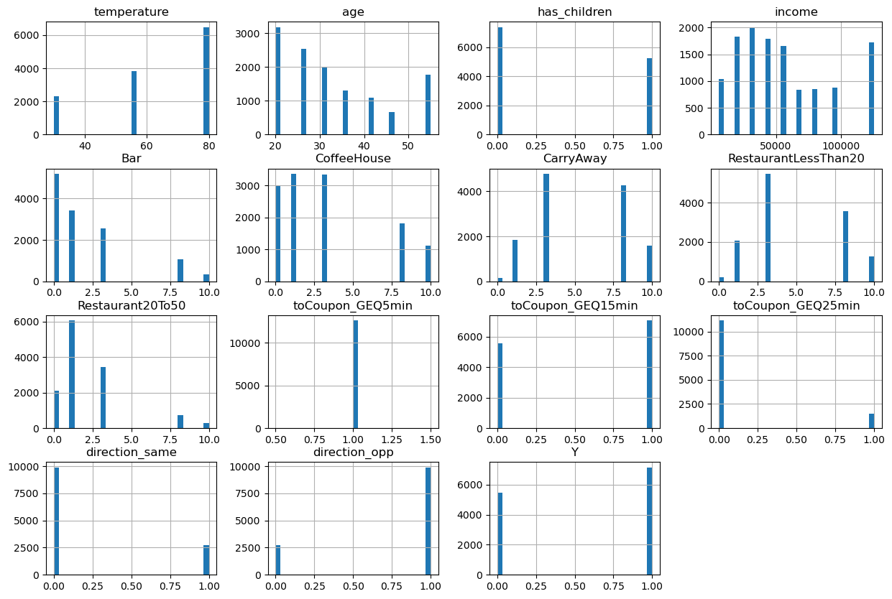

We don't see any attribute that has prominent outliers.
#####  One interesting outcome from the above plot is that`toCoupon_GEQ5mins` adds no value to the dataset, it is always set to 1.We can drop this column 

### 4.2 Exploratory Data Analysis On Whole Dataset
Here we will find correlation and plot visualization of various attributes on whole data set.

#### 4.2.1 Income Attribute Analysis
Below shows the coupon acceptance histogram:

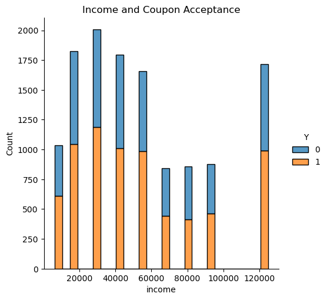

Income does not seem to have any effect on coupon acceptance.

#### 4.2.2 Age Attribute Analysis
The coupon acceptance by `age` histogram is not very interesting in terms of acceptance rate.
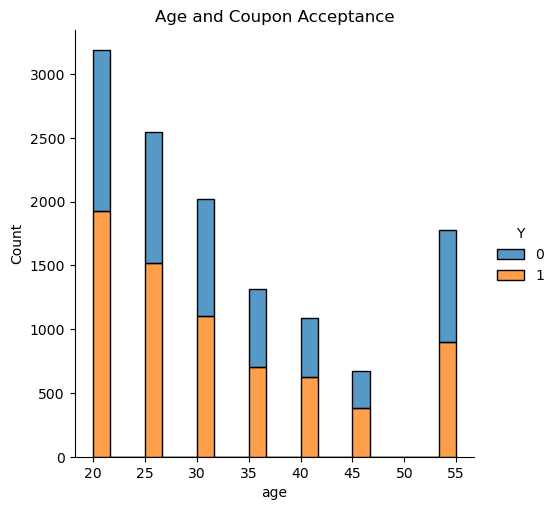

#### 4.2.3 Passenger Attribute Analysis
Here we see that drivers with Friends or Partners show slightly higher acceptance rate
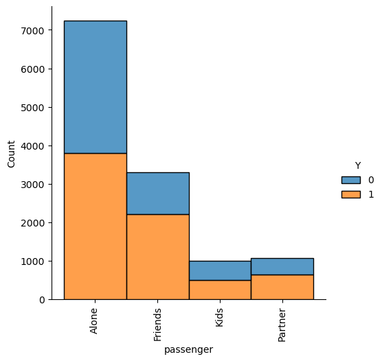

The mean acceptance rate by passenger type is below:
|    | passenger   |        Y |
|---:|:------------|---------:|
|  0 | Alone       | 0.524421 |
|  1 | Friends     | 0.673147 |
|  2 | Kids        | 0.504496 |
|  3 | Partner     | 0.594013 |

#### 4.2.4 Coupon Attribute Analysis
Below shows that `coupon` values Carry Out and Restaurant(<20>) have higher acceptance rate

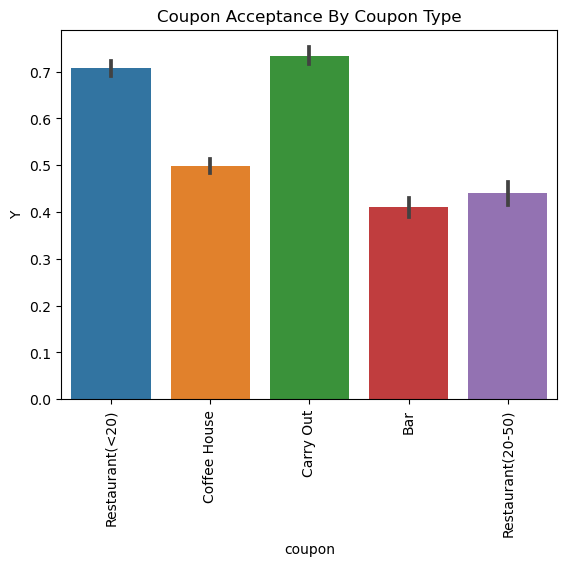

The mean acceptance rate by coupon type is below:

|    | coupon            |        Y |
|---:|:------------------|---------:|
|  0 | Bar               | 0.40995  |
|  1 | Carry Out         | 0.733788 |
|  2 | Coffee House      | 0.498621 |
|  3 | Restaurant(20-50) | 0.441532 |
|  4 | Restaurant(<20)   | 0.707809 |

#### 4.2.5 Other Attribute Analysis
After checking the mean acceptance rate for all other attributes, found the following to be interesting:

|    | education            |        Y |
|---:|:---------------------|---------:|
|  0 | Associates degree    | 0.552265 |
|  1 | Bachelors degree     | 0.554013 |
|  2 | Graduate degree      | 0.523262 |
|  3 | High School Graduate | 0.591769 |
|  4 | Some High School     | 0.715909 |
|  5 | Some college         | 0.595838 |

|    | expiration   |        Y |
|---:|:-------------|---------:|
|  0 | 1d           | 0.624378 |
|  1 | 2h           | 0.495967 |

##### Though `education` = 'Some High School' showed high acceptance rate, the number of entries for this is too low to be a good indicator

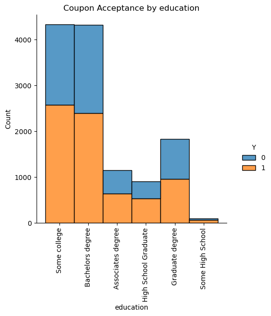

`expiration` shows slightly higher acceptance rate for longer expiration

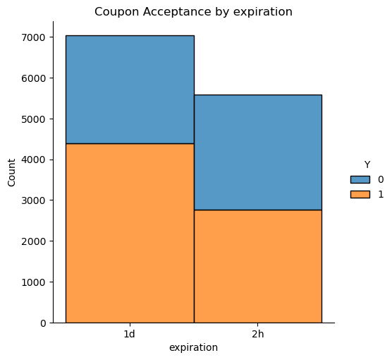

Before we go into deeper analysis of each coupon group, lets drop the `toCoupon_GEQ5min` column as per previous decision

Index(['destination', 'passenger', 'weather', 'temperature', 'time', 'coupon',
       'expiration', 'gender', 'age', 'maritalStatus', 'has_children',
       'education', 'occupation', 'income', 'Bar', 'CoffeeHouse', 'CarryAway',
       'RestaurantLessThan20', 'Restaurant20To50', 'toCoupon_GEQ15min',
       'toCoupon_GEQ25min', 'direction_same', 'direction_opp', 'Y'],
      dtype='object')

##### Based on all the above analysis we can come up with some basic hypothesis:

##### 1. Coupon type seem to affect the acceptance rate - Carry Out and Restaurant(less than 20) show highest acceptance rate
##### 2. Passenger type has some influence. Those traveling with Friends or Partner seem to more readily accept coupon
##### 3. Expiration has a slight influence. Longer the expiration , more readily the coupon is accepted.
##### 4. All other features have little to no influence on acceptance rate given the whole dataset.

### 4.3 Exploratory Data Analysis By Coupon Type

The questions answered here are:
1. Is there a correlation between frequency of business visit to the coupon acceptance?
2. What other attributes affect coupon acceptance keeping frequency of business visit constant?
3. Can a hypothesis be made for the acceptance of coupon?

#### 4.3.1 `Bar` Coupon Analysis
Following is the correlation heatmap with Bar coupon only data. This shows `Bar` has better correlation with Y.

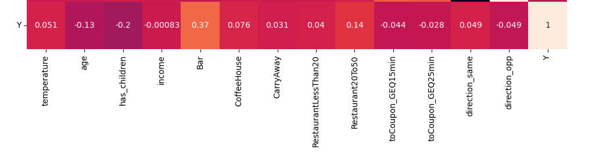

Proportion of Bar coupons accepted : 0.40

Acceptance rate with Bar frequency > 1 : 0.69
Acceptance rate with Bar frequency <= 1:  0.28

Definitely offer Bar coupon to those who frequent the business more.

Acceptance rate - Bar > 1 and age > 25 is  0.7009345794392523
Acceptance rate - others is  0.33122629582806573

Acceptance rate - Bar > 1 and no kid and farming is 0.7168458781362007
Acceptance rate - others is  0.33122629582806573

Even if other attributes like income, age, passenger, occupation were included, for Bar with higher frequency the acceptance rate remained around 0.7 and for lower frequency it was 0.3.

##### We can conclude from this that Bar coupon acceptance increases with Bar frequency alone.

#### 4.3.2 `CarryAway` Coupon Analysis
Following is the correlation heat map with CarryAway only data. There is no clear correlation seen here

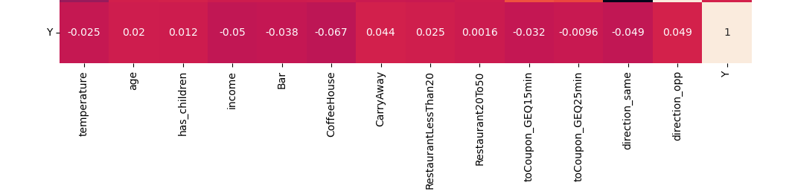

Proportion of CarryAway coupons accepted: 0.73  which is much higher than Bar

Acceptance rate with frequency of visit > 1 : 0.74
Acceptance rate with frequency of visit <=1 : 0.67

Not a huge difference, the frequency is not a great indicator to offer the coupon unlike the Bar data.

One interesting find between those who CarryAway more frequently and those who don't is that, other attributes like income, age, passenger play a bigger role when CarryAway < 1. This was not observed with Bar coupons.

###### CarryAway >= 1:
Without Kid Passenger:  0.73
With Kid Passenger   :  0.70

Age <= 25: 0.73
Age > 25: 0.73

Income < 30000 : 0.75
Income >= 30000 : 0.73

###### CarryAway < 1:
Without Kid Passenger:  0.75
With Kid Passenger   :  0.66

Age <= 25: 0.88
Age > 25: 0.68

Income < 30000 : 1.0
Income >= 30000 : 0.69

#####  In conclusion, if CarryAway > 1, always a good idea to offer the Carry Out coupon. If not, lower income or younger or non-kid passenger drivers could be offered the coupon

#### 4.3.2 `Restaurant20-50` Coupon Analysis
Following is the correlation heat map with Restaurant20-50 coupon only data. There is a slight correlation seen with the frequency of visits to Y.

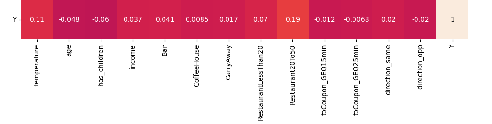

Proportion of CarryAway coupons accepted: 0.44

Acceptance rate with frequency of visit >  1 : 0.56
Acceptance rate with frequency of visit <= 1: 0.38

Definitely an option to offer this coupon if the frequency of visit is higher.

While the other attributes like income, age, passenger don't affect acceptance rate when frequency is > 1 , `income` plays a slight role when frequency is <=1 
Income > 30000 : 0.4
Income <= 30000 : 0.3

#####  In conclusion, if Restaurant20-50 > 1, can consider offering the coupon. If not, best not to offer this coupon. 

#### 4.3.3 Quick Analysis of `CoffeHouse` and `RestaurantLessThan20` Coupons:
Lets look at the correlation heat map for both.

###### Coffee House
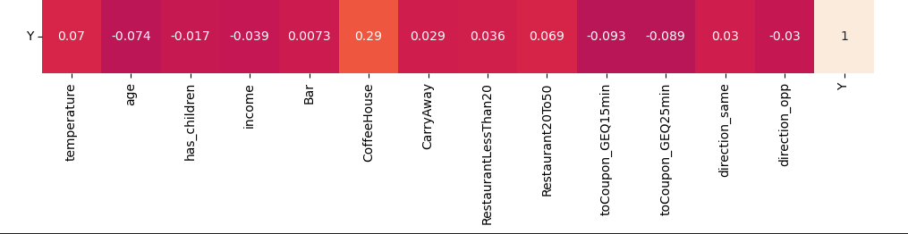

This shows positive correlation with Y similar to Bar. We can hypothesize that Coffee coupons should be offered to drivers who frequently visit the business

###### Restaurant Less Than 20

Here there is no strong correlation. This will need more analysis. But given the histogram in the EDA, similar to CarryAway, this category also showed high acceptance rate. So we can assume this coupon will be accepted generally.

## 5.0 Conclusion

##### 1. Who should be offered the Bar coupon?
######  Those who visit Bar more than once a month should be offered the Bar coupon

##### 2. Who should be offered the Carry Out coupon?
######  Those who do CarryAway more than once a month should definitely be offered this coupon. Otherwise, lower income or younger than 25 or no kid passenger drivers should be offered this coupon

##### 3. Who should be offered the Restaurant 20-50 coupon?
######  Only when the drivers have frequented the business more than once a month or higher should be offered this coupon

##### 4. Who should be offered the CoffeeHouse coupon?
######  Based on quick analysis, we will go by frequency of business visit more than once a month

##### 5. Who should be offered the RestaurantLessThan20 coupon?
######  Generally this is a good coupon to offer. Need more analysis to fine tune the criteria.

#### Some next steps:
1. More data analysis of CoffeHouse and RestaurantLessThan20 coupons.
2. Choosing the right model for the data
3. Modeling the data and tuning it.
4. Testing the model
5. Deploying the model

 

