# Comparing Classifiers Performance
The dataset under study is from UCI Machine Learning Repository. The data is related with direct marketing campaigns of a Portuguese banking institution. The marketing campaigns were based on phone calls. The goal of this case study is to compare the performance of different machine learning classifiers in predicting if a customer will sign up for term deposit.

## 1. Business Understanding
Many different factors affect whether a customer would sign up for a product(term deposit) at a bank. Three major areas which matter are bank's metrics like the euribor exchange rate, how big the bank is, customer profile like education, income etc, and the effort put into campaigning for the product. We could use data science and machine learning to understand what features are most important for a customer to sign up for a term deposit. Also, we want to explore the different machine learning classifiers and provide a recommendation on which one is best suited for the task at hand.


### 1.1 Business Goals
1. Provide a report on performance metrics and runtime for various classifiers
2. Educate on what features are most important for a customer to sign up for term deposit
3. Provide a recommendation on which classifier is best suited

## 2. Data Understanding
Here we take an initial look at the given data and explore the quality of it.

### 2.1 Gather Data And Describe
The original dataset is from UCI Machine Learning Repository.In this case study, the full additional set is used which contains about 40K entries and 21 columns.

Here is a sample of the data:
<div class="overflow-table">

|    |   age | job       | marital   | education           | default   | housing   | loan   | contact   | month   | day_of_week   |   campaign |   pdays |   previous | poutcome    |   emp.var.rate |   cons.price.idx |   cons.conf.idx |   euribor3m |   nr.employed | y   |
|---:|------:|:----------|:----------|:--------------------|:----------|:----------|:-------|:----------|:--------|:--------------|-----------:|--------:|-----------:|:------------|---------------:|-----------------:|----------------:|------------:|--------------:|:----|
|  0 |    56 | housemaid | married   | basic.4y            | no        | no        | no     | telephone | may     | mon           |          1 |     999 |          0 | nonexistent |            1.1 |           93.994 |           -36.4 |       4.857 |          5191 | no  |
|  2 |    37 | services  | married   | high.school         | no        | yes       | no     | telephone | may     | mon           |          1 |     999 |          0 | nonexistent |            1.1 |           93.994 |           -36.4 |       4.857 |          5191 | no  |
|  3 |    40 | admin.    | married   | basic.6y            | no        | no        | no     | telephone | may     | mon           |          1 |     999 |          0 | nonexistent |            1.1 |           93.994 |           -36.4 |       4.857 |          5191 | no  |
|  4 |    56 | services  | married   | high.school         | no        | no        | yes    | telephone | may     | mon           |          1 |     999 |          0 | nonexistent |            1.1 |           93.994 |           -36.4 |       4.857 |          5191 | no  |
|  6 |    59 | admin.    | married   | professional.course | no        | no        | no     | telephone | may     | mon           |          1 |     999 |          0 | nonexistent |            1.1 |           93.994 |           -36.4 |       4.857 |          5191 | no  |


</div>

More info on the type of data:

```
RangeIndex: 41188 entries, 0 to 41187
Data columns (total 21 columns):
 #   Column          Non-Null Count  Dtype  
---  ------          --------------  -----  
 0   age             41188 non-null  int64  
 1   job             41188 non-null  object 
 2   marital         41188 non-null  object 
 3   education       41188 non-null  object 
 4   default         41188 non-null  object 
 5   housing         41188 non-null  object 
 6   loan            41188 non-null  object 
 7   contact         41188 non-null  object 
 8   month           41188 non-null  object 
 9   day_of_week     41188 non-null  object 
 10  duration        41188 non-null  int64  
 11  campaign        41188 non-null  int64  
 12  pdays           41188 non-null  int64  
 13  previous        41188 non-null  int64  
 14  poutcome        41188 non-null  object 
 15  emp.var.rate    41188 non-null  float64
 16  cons.price.idx  41188 non-null  float64
 17  cons.conf.idx   41188 non-null  float64
 18  euribor3m       41188 non-null  float64
 19  nr.employed     41188 non-null  float64
 20  y               41188 non-null  object 
dtypes: float64(5), int64(5), object(11)
memory usage: 6.6+ MB
```

Initial observations:
1. We have 41188 entries and 21 columns
2. There are no explicit NaN values
3. Many features are categorical
4. Based on description given with the dataset will drop 'duration' column
('duration' - last contact duration, in seconds (numeric). Important note: this attribute highly affects the output target (e.g., if duration=0 then y='no'). Yet, the duration is not known before a call is performed. Also, after the end of the call y is obviously known. Thus, this input should only be included for benchmark purposes and should be discarded if the intention is to have a realistic predictive model)

### 2.2 Early Data Exploration and Quality Check
In this section, we determine the following:
1. Are there duplicates in the data?
2. What columns have NaN values and how many?
3. Are there any structural issues with the data including typos and dtype?

#### Duplicates:
Check for duplicates returned the following:

Number of duplicates: 12

#### Null Values:

Null value check returned the following:

```
age               0
job               0
marital           0
education         0
default           0
housing           0
loan              0
contact           0
month             0
day_of_week       0
campaign          0
pdays             0
previous          0
poutcome          0
emp.var.rate      0
cons.price.idx    0
cons.conf.idx     0
euribor3m         0
nr.employed       0
y                 0
```

#### Structural Issues

One issue with the categorical features is that many of them have a value 'unknown' in them. These entries need to be nullified and removed.

<details>
| job           |   count |
|:--------------|--------:|
| admin.        |   10419 |
| blue-collar   |    9253 |
| technician    |    6739 |
| services      |    3967 |
| management    |    2924 |
| retired       |    1718 |
| entrepreneur  |    1456 |
| self-employed |    1421 |
| housemaid     |    1060 |
| unemployed    |    1014 |
| student       |     875 |
| unknown       |     330 |
| marital   |   count |
|:----------|--------:|
| married   |   24921 |
| single    |   11564 |
| divorced  |    4611 |
| unknown   |      80 |
| education           |   count |
|:--------------------|--------:|
| university.degree   |   12164 |
| high.school         |    9512 |
| basic.9y            |    6045 |
| professional.course |    5240 |
| basic.4y            |    4176 |
| basic.6y            |    2291 |
| unknown             |    1730 |
| illiterate          |      18 |
| default   |   count |
|:----------|--------:|
| no        |   32577 |
| unknown   |    8596 |
| yes       |       3 |
| housing   |   count |
|:----------|--------:|
| yes       |   21571 |
| no        |   18615 |
| unknown   |     990 |
| loan    |   count |
|:--------|--------:|
| no      |   33938 |
| yes     |    6248 |
| unknown |     990 |
| contact   |   count |
|:----------|--------:|
| cellular  |   26135 |
| telephone |   15041 |
| month   |   count |
|:--------|--------:|
| may     |   13767 |
| jul     |    7169 |
| aug     |    6176 |
| jun     |    5318 |
| nov     |    4100 |
| apr     |    2631 |
| oct     |     717 |
| sep     |     570 |
| mar     |     546 |
| dec     |     182 |
| day_of_week   |   count |
|:--------------|--------:|
| thu           |    8618 |
| mon           |    8512 |
| wed           |    8134 |
| tue           |    8086 |
| fri           |    7826 |
| poutcome    |   count |
|:------------|--------:|
| nonexistent |   35551 |
| failure     |    4252 |
| success     |    1373 |
| y   |   count |
|:----|--------:|
| no  |   36537 |
| yes |    4639 |
</details>

#### General Observations

This is an imbalanced dataset
```
y
no     36537
yes     4639
```
Features like `age` `housing` `education` or `marital` don't show much correlation with `y` at all.
As an example, below is a plot for `education` and `age`.
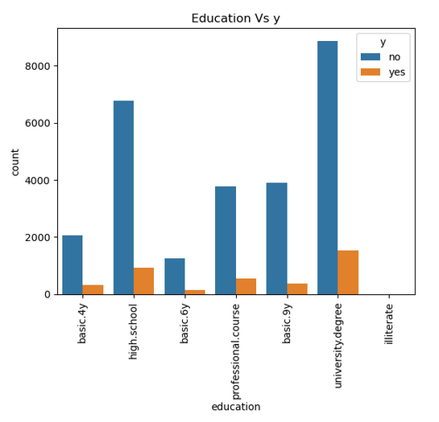

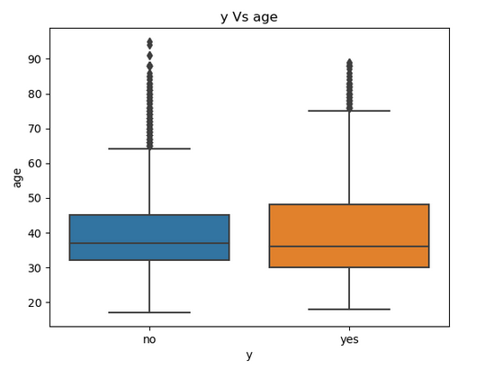

The median age is almost same for both 'yes' and 'no'. There are some outliers here.

Features like `euribor3m` and `campaign` show some correlation.
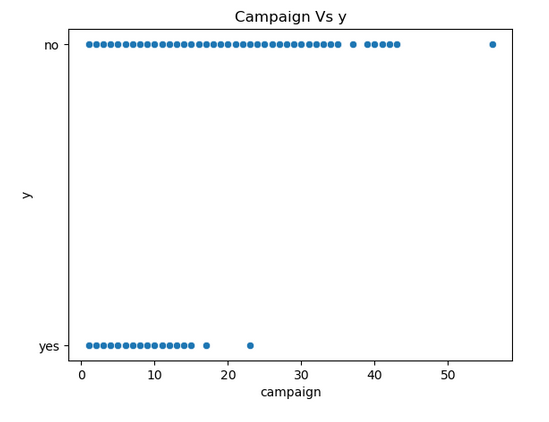

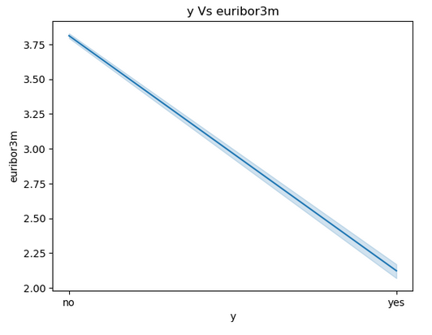

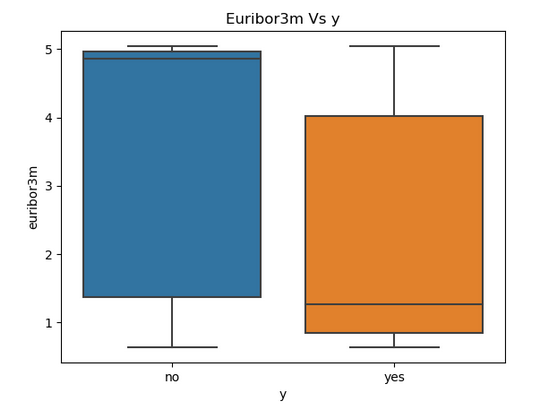
The median is shifted quite a bit between 'yes' and 'no'

Features `cons.price.idx` and `cons.conf.idx` also show somw correlation with `y` though not as strong as `euribor3m`

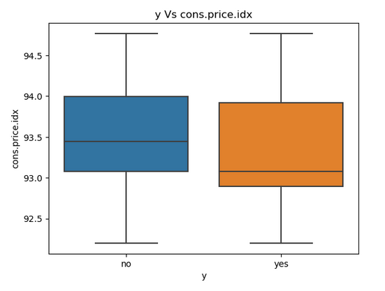

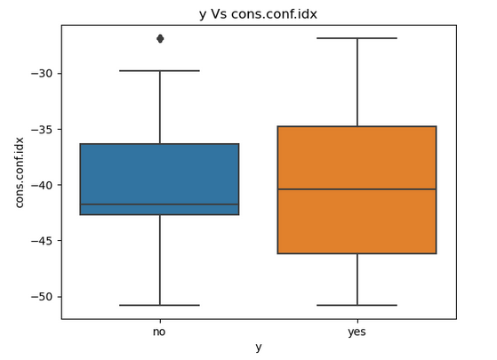

`emp.var.rate` seems to have a good correlation with `y` as well. The median is shifted a lot.

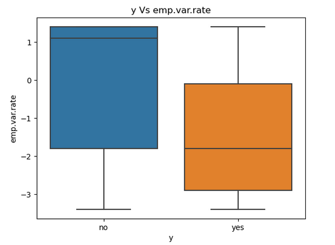

Though `month` does not seem to have much correlation, the months of March, September, October, December seem to have higher sign up rate than other months.
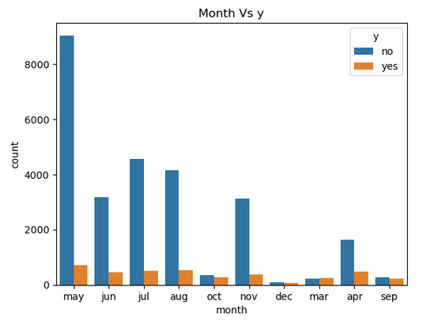


Based on analysing the data, the following decisions are taken:

1. Remove `duration` column.
2. Remove all duplicates.
3. Nullify all 'unknown' values in columns and remove them all
4. Use OneHotEncoder to transform all categorical columns.

## 3. Data Preparation
In this section, we will act on the observation and decisions taken above.

1. Remove unknown entries
2. Remove unnecessary columns
3. Apply transformations for categorical columns
4. Correlation check
5. Split the data into train,dev,cross validation sets
6. Analyse the important features


#### Remove unknown values 
After removing unknown values from categorical columns, the value counts are as below:
```
| job           |   count |
|:--------------|--------:|
| admin.        |   10419 |
| blue-collar   |    9253 |
| technician    |    6739 |
| services      |    3967 |
| management    |    2924 |
| retired       |    1718 |
| entrepreneur  |    1456 |
| self-employed |    1421 |
| housemaid     |    1060 |
| unemployed    |    1014 |
| student       |     875 |
| marital   |   count |
|:----------|--------:|
| married   |   24921 |
| single    |   11564 |
| divorced  |    4611 |
| education           |   count |
|:--------------------|--------:|
| university.degree   |   12164 |
| high.school         |    9512 |
| basic.9y            |    6045 |
| professional.course |    5240 |
| basic.4y            |    4176 |
| basic.6y            |    2291 |
| illiterate          |      18 |
| default   |   count |
|:----------|--------:|
| no        |   32577 |
| yes       |       3 |
| housing   |   count |
|:----------|--------:|
| yes       |   21571 |
| no        |   18615 |
| loan   |   count |
|:-------|--------:|
| no     |   33938 |
| yes    |    6248 |
| contact   |   count |
|:----------|--------:|
| cellular  |   26135 |
| telephone |   15041 |
| month   |   count |
|:--------|--------:|
| may     |   13767 |
| jul     |    7169 |
| aug     |    6176 |
| jun     |    5318 |
| nov     |    4100 |
| apr     |    2631 |
| oct     |     717 |
| sep     |     570 |
| mar     |     546 |
| dec     |     182 |
| day_of_week   |   count |
|:--------------|--------:|
| thu           |    8618 |
| mon           |    8512 |
| wed           |    8134 |
| tue           |    8086 |
| fri           |    7826 |
| poutcome    |   count |
|:------------|--------:|
| nonexistent |   35551 |
| failure     |    4252 |
| success     |    1373 |
| y   |   count |
|:----|--------:|
| no  |   36537 |
| yes |    4639 |
```


#### Remove unnecessary column:
Removed `duration` column as suggested by dataset description and dropped all NaN resulting from above step.
```
Index: 30478 entries, 0 to 41187
Data columns (total 20 columns):
 #   Column          Non-Null Count  Dtype  
---  ------          --------------  -----  
 0   age             30478 non-null  int64  
 1   job             30478 non-null  object 
 2   marital         30478 non-null  object 
 3   education       30478 non-null  object 
 4   default         30478 non-null  object 
 5   housing         30478 non-null  object 
 6   loan            30478 non-null  object 
 7   contact         30478 non-null  object 
 8   month           30478 non-null  object 
 9   day_of_week     30478 non-null  object 
 10  campaign        30478 non-null  int64  
 11  pdays           30478 non-null  int64  
 12  previous        30478 non-null  int64  
 13  poutcome        30478 non-null  object 
 14  emp.var.rate    30478 non-null  float64
 15  cons.price.idx  30478 non-null  float64
 16  cons.conf.idx   30478 non-null  float64
 17  euribor3m       30478 non-null  float64
 18  nr.employed     30478 non-null  float64
 19  y               30478 non-null  object 
dtypes: float64(5), int64(4), object(11)
```


#### Transformations:

Used OneHotEncoder for all categorical columns
```
Index: 30478 entries, 0 to 41187
Data columns (total 53 columns):
 #   Column                         Non-Null Count  Dtype  
---  ------                         --------------  -----  
 0   job_admin.                     30478 non-null  float64
 1   job_blue-collar                30478 non-null  float64
 2   job_entrepreneur               30478 non-null  float64
 3   job_housemaid                  30478 non-null  float64
 4   job_management                 30478 non-null  float64
 5   job_retired                    30478 non-null  float64
 6   job_self-employed              30478 non-null  float64
 7   job_services                   30478 non-null  float64
 8   job_student                    30478 non-null  float64
 9   job_technician                 30478 non-null  float64
 10  job_unemployed                 30478 non-null  float64
 11  marital_divorced               30478 non-null  float64
 12  marital_married                30478 non-null  float64
 13  marital_single                 30478 non-null  float64
 14  education_basic.4y             30478 non-null  float64
 15  education_basic.6y             30478 non-null  float64
 16  education_basic.9y             30478 non-null  float64
 17  education_high.school          30478 non-null  float64
 18  education_illiterate           30478 non-null  float64
 19  education_professional.course  30478 non-null  float64
 20  education_university.degree    30478 non-null  float64
 21  default_yes                    30478 non-null  float64
 22  housing_yes                    30478 non-null  float64
 23  loan_yes                       30478 non-null  float64
 24  contact_telephone              30478 non-null  float64
 25  month_apr                      30478 non-null  float64
 26  month_aug                      30478 non-null  float64
 27  month_dec                      30478 non-null  float64
 28  month_jul                      30478 non-null  float64
 29  month_jun                      30478 non-null  float64
 30  month_mar                      30478 non-null  float64
 31  month_may                      30478 non-null  float64
 32  month_nov                      30478 non-null  float64
 33  month_oct                      30478 non-null  float64
 34  month_sep                      30478 non-null  float64
 35  day_of_week_fri                30478 non-null  float64
 36  day_of_week_mon                30478 non-null  float64
 37  day_of_week_thu                30478 non-null  float64
 38  day_of_week_tue                30478 non-null  float64
 39  day_of_week_wed                30478 non-null  float64
 40  poutcome_failure               30478 non-null  float64
 41  poutcome_nonexistent           30478 non-null  float64
 42  poutcome_success               30478 non-null  float64
 43  y_yes                          30478 non-null  float64
 44  age                            30478 non-null  int64  
 45  campaign                       30478 non-null  int64  
 46  pdays                          30478 non-null  int64  
 47  previous                       30478 non-null  int64  
 48  emp.var.rate                   30478 non-null  float64
 49  cons.price.idx                 30478 non-null  float64
 50  cons.conf.idx                  30478 non-null  float64
 51  euribor3m                      30478 non-null  float64
 52  nr.employed                    30478 non-null  float64
dtypes: float64(49), int64(4)
```

#### Correlation check
Below is the correlation numbers between target 'y' and rest of the features.
```
job_admin.                       0.023880
job_blue-collar                 -0.067493
job_entrepreneur                -0.019589
job_housemaid                   -0.000227
job_management                  -0.002435
job_retired                      0.102490
job_self-employed               -0.003307
job_services                    -0.035053
job_student                      0.088626
job_technician                  -0.013188
job_unemployed                   0.020916
marital_divorced                -0.012185
marital_married                 -0.031638
marital_single                   0.042295
education_basic.4y               0.009096
education_basic.6y              -0.018789
education_basic.9y              -0.045821
education_high.school           -0.009155
education_illiterate             0.008351
education_professional.course   -0.002430
education_university.degree      0.046512
default_yes                     -0.003777
housing_yes                      0.010171
loan_yes                        -0.005038
contact_telephone               -0.143862
month_apr                        0.077834
month_aug                       -0.015995
month_dec                        0.074609
month_jul                       -0.034869
month_jun                       -0.001670
month_mar                        0.146314
month_may                       -0.112558
month_nov                       -0.023973
month_oct                        0.141569
month_sep                        0.124391
day_of_week_fri                 -0.012550
day_of_week_mon                 -0.021640
day_of_week_thu                  0.016727
day_of_week_tue                  0.008888
day_of_week_wed                  0.008293
poutcome_failure                 0.021739
poutcome_nonexistent            -0.191555
poutcome_success                 0.319914
y_yes                            1.000000
age                              0.048700
campaign                        -0.069200
pdays                           -0.327549
previous                         0.228030
emp.var.rate                    -0.305320
cons.price.idx                  -0.128657
cons.conf.idx                    0.061543
euribor3m                       -0.315842
nr.employed                     -0.364230
```
No strong correlation between target and features. `euribor3m` `nr.employed` `emp.var.rate` `pdays` seem to have some negative correlation though not high.


#### Dataset split up
As part of further preparation we split the data into training and test set. The split will be 80/20.
The resulting size of the sets are as follows:
Training : (24382, 52)
Test     : (6096, 52)

#### Important features

The top most important features with importance mean and standard deviation are as follows:
```
emp.var.rate --> 0.203 +/- 0.004
cons.price.idx --> 0.086 +/- 0.003
nr.employed --> 0.025 +/- 0.002
pdays    --> 0.011 +/- 0.001
euribor3m --> 0.005 +/- 0.001
contact_telephone --> 0.004 +/- 0.001
month_jun --> 0.002 +/- 0.001
poutcome_success --> 0.002 +/- 0.000
cons.conf.idx --> 0.002 +/- 0.001
job_student --> 0.001 +/- 0.000
education_basic.4y --> 0.001 +/- 0.000
education_basic.9y --> 0.001 +/- 0.000
```
This aligns with the correlation numbers we got earlier. 


## 4.0 Modeling
The approach we will take to finding a good model is as follows:

1. Evaluate a baseline model
2. Fit default LogisticRegression, KNN, Support Vector Machine and Decision Tree models and tabulate accuracy
3. Fine tune the above models through GridSearchCV and observe how accuracy, precision, recall and runtime vary.


#### Performance metrics
The most important metric here is the recall for the positive class. We want to correctly predict all customers who will sign up for term deposit.
Receiver Operating Characteristic(ROC) and the Area Under Curve(AUC) is a good measure for the prediction.

#### Baseline model(all features):
This is an imbalanced dataset
```
y_yes
0.0    26620
1.0     3858
```

If the baseline was to predict the majority class, we get zero recall score. Recall score for value 1 is very important for our classification problem. We want to correctly identify all candidates who will accept term deposit. DummyClassifier with stratified option would be a better baseline model even though the recall score is very less.

```
             precision    recall  f1-score   support

         0.0       0.87      0.88      0.88      5324
         1.0       0.13      0.13      0.13       772

    accuracy                           0.78      6096
   macro avg       0.50      0.50      0.50      6096
weighted avg       0.78      0.78      0.78      6096

```
The baseline model ROC curve is below. It shows the prediction is almost random.
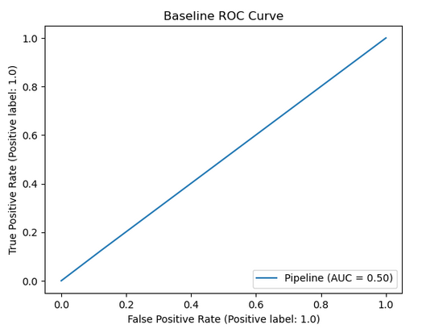


#### Default Classifiers Comparison With All Features:

We fit the training set through a pipeline which consists of:
1. StandardScaler()
2. One of the classifiers with default setting(LogisticRegression, KNN, Decision Trees and Support Vector Machines)

Results are below:

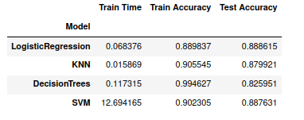

Decision Tree seems to overfit the training data resulting in much lower test accuracy. Support Vector Machine takes much longer to train than others.
Logistic Regression and KNN seem to do a decent job.

As already mentioned, recall for the positive class is a more important metric. Here is a plot of precision and recall across all classifiers.

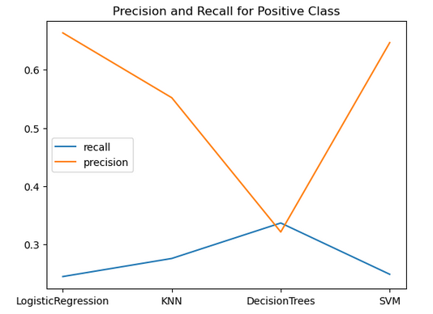

We are doing poorly in terms of recall across all classifiers. Better than the baseline though.

#### Default Classifiers Comparison With Important Features:
Will use only the most important features to see if there is any difference in performance metrics.

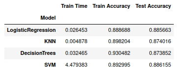

One big difference here is the lower train time across all classifiers. There is no significant difference in test accuracy. Decision Tree
does not seem to overfit here.

Lets look at the precision and recall.

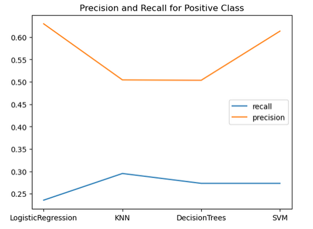

Here, precision seems to be either better are same across classifiers and recall is slightly lesser or same. No significant difference.
We can use only the most important features to further tune the models.

#### Hyperparameter tuning

Below is the table with the models, best params, train time and accuracy. Overall, SVM took a very long time to train even with just one parameter.
Logistic Regression and KNN were tried with many parameters but the results were similar and longer runtime. Here below have used only basic parameter tuning for those two models.

<div class="overflow-table">

|    | Model              | Best Params                                                                                                          |   Train Time |   Train Accuracy |   Test Accuracy |
|---:|:-------------------|:---------------------------------------------------------------------------------------------------------------------|-------------:|-----------------:|----------------:|
|  0 | LogisticRegression | {'lgr__C': 1.0}                                                                                                      |      4.71485 |         0.887905 |        0.887176 |
|  1 | KNN                | {'knn__n_neighbors': 3}                                                                                              |     18.1078  |         0.891923 |        0.872745 |
|  2 | DecisionTrees      | {'dtree__criterion': 'entropy', 'dtree__max_depth': 9, 'dtree__min_samples_leaf': 4, 'dtree__min_samples_split': 10} |     31.0417  |         0.894301 |        0.885208 |
|  3 | SVM                | {'kernel' = 'poly'}                                                                                                  |     61.6277  |         0.888684 |        0.88652  |

</div>

The accuracy scores are similar to default models. But we know the more important score is recall/precision

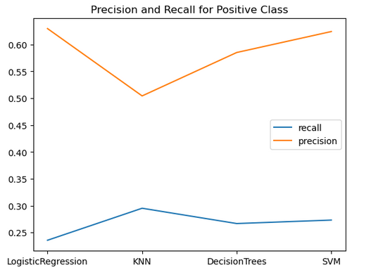

There is some variation but no significant difference. It seems we need a better metric to compare the classifiers. In the 'Evaluation' section below, we will use the ROC AUC score to see if it sheds more light on the best model to pick for our case. 

## 5.0 Evaluation

In this section, lets do the following:
1. Compare ROC-AUC curve for default model across classifiers.
2. Compare ROC-AUC curve for tuned models across classifiers.
3. Verify if using polynomial features on the best model improves perfromance more. 

#### Default Model ROC-AUC comparison

The default models AUC scores don't look so bad. Logistic Regression has the highest value.

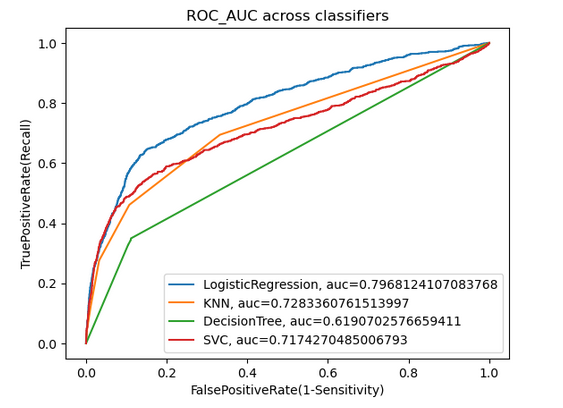


#### Tuned Model ROC-AUC comparison
The tuning seems to have helped only the Decision Tree quite well. For LogisticRegression and KNN, it does not seem to improve the AUC score. For Support vector machine, the tuning was cumbersome with many parameters.

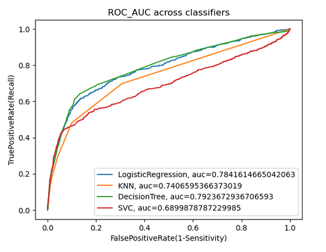

#### Other Considerations
Tried Polynomial features of degree 2 of the top features identified prior to fit with DecisionTree, the results were only slightly improved. It was not worth the really long runtime.

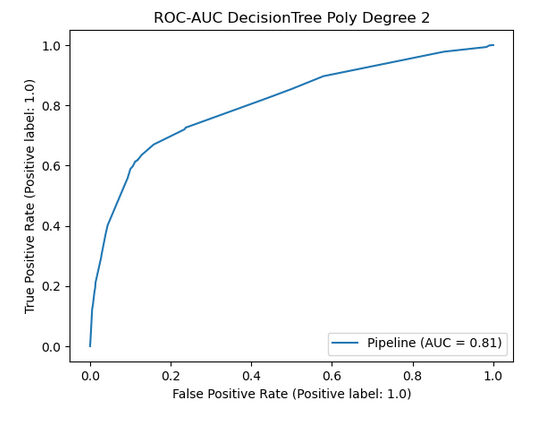

## 6.0 Deployment
The tuned DecisionTree Classifier has the highest AUC score and train time is reasonable. This model can be deployed to predict if a customer would sign up for 
term deposit. Logistic Regression is a close second. Support Vector Machine took long train times with no significant improvement in any of the performance metrics.

The top features that influence the outcome are as follows:
1. Nation's Employment Variance Rate
2. Consumer Price Index
3. Number of Employees in the bank(indicator of size of bank)
4. Number of days since the customer was contacted previously
5. Euribor Exchange Rate
6. Contact method
7. Consumer Confidence Index
8. Outcome of previous marketing campaign
9. Month of contact

Not all features above can be controlled by the bank. The ones that can be like the month of contact, confidence index can be taken into account for
any new campaign.

Next steps:
1. Other more advanced models like deep learning models can be explored 
2. Need to collect more positive class data to create a more balanced dataset.Alternatively can use over-sampling of minority class to generate more
   positive class entries.


 


