# Factors that drive price of used cars
The dataset under study contains information on used cars and their sale price. The goal of this case study is to come up with what features drive the sale price of a used car.

## 1. Business Understanding
In earlier days, when all cars were gas or diesel driven, there was enough experience among the staff to determine what cars would sell at a high price. With the introduction of hybrid and electric vehicles and autonomous features, there are different factors that influence the used car sale. Data science can see hidden patterns and provide a better way to determine the factors that drive sale price and help the business make more profits.


### 1.1 Business Goals
1. Predict sale price of used car that is yet to be procured by the business
2. Educate on what factors drive the sale price for different category of vehicles.
3. Report any limitations of findings

## 2. Data Understanding
Here we take an initial look at the given data and explore the quality of it.

### 2.1 Gather Data And Describe
Data comes from UCI Machine Learning repository and was collected via a survey on Amazon Mechanical Turk.

Here is a sample of the data:

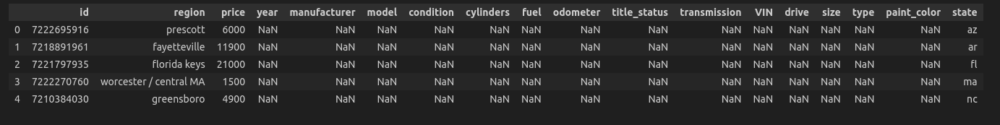

More info on the type of data:

RangeIndex: 426880 entries, 0 to 426879
Data columns (total 18 columns):
 #   Column        Non-Null Count   Dtype  
---  ------        --------------   -----  
 0   id            426880 non-null  int64  
 1   region        426880 non-null  object 
 2   price         426880 non-null  int64  
 3   year          425675 non-null  float64
 4   manufacturer  409234 non-null  object 
 5   model         421603 non-null  object 
 6   condition     252776 non-null  object 
 7   cylinders     249202 non-null  object 
 8   fuel          423867 non-null  object 
 9   odometer      422480 non-null  float64
 10  title_status  418638 non-null  object 
 11  transmission  424324 non-null  object 
 12  VIN           265838 non-null  object 
 13  drive         296313 non-null  object 
 14  size          120519 non-null  object 
 15  type          334022 non-null  object 
 16  paint_color   296677 non-null  object 
 17  state         426880 non-null  object 
dtypes: float64(2), int64(2), object(14)
memory usage: 58.6+ MB

Initial observations:
1. We have 426880 entries and 18 columns
2. There are quite a lot of 'NaN' values in the dataset across columns
3. Most of the features are categorical

### 2.2 Early Data Exploration and Quality Check
In this section, we determine the following:
1. Are there duplicates in the data?
2. What columns have NaN values and how many?
3. Are there any structural issues with the data including typos and dtype?

#### Duplicates:
Check for duplicates returned the following:

Number of duplicates: 0

#### Null Values:

Null value check returned the following:

id                   0
region               0
price                0
year              1205
manufacturer     17646
model             5277
condition       174104
cylinders       177678
fuel              3013
odometer          4400
title_status      8242
transmission      2556
VIN             161042
drive           130567
size            306361
type             92858
paint_color     130203
state                0
dtype: int64

General guideline for filling columns based on domain:
1. Only columns that have 10000 or more NaN are considered
2. 'Manufacturer' can be filled from 'Model'
3. 'Cylinders' can be filled from 'Model'
4. 'Condition' can be filled from 'odometer' and 'year'
5. 'Type', 'Size', 'Drive' all can be filled from 'model'
6. 'paint_color' can be filled from 'model' and 'price'

#### Structural Issues

The major structural issue is that columns which say type as 'object' are not string and need to be converted to string

#### General Observations

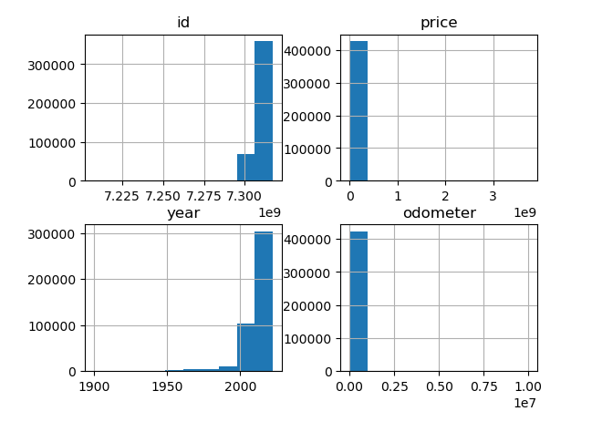
Existing numerical columns have skewed distribution, they need to be normalized

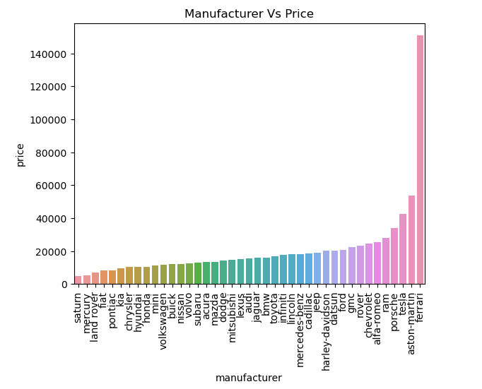
Ferrari has a very high price point compared to others which is accurate

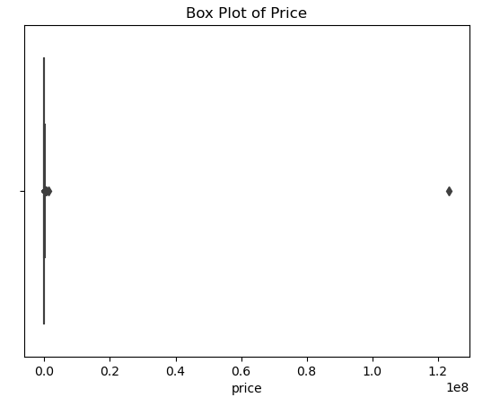
We seem to have a lot of outliers in 'price', have to handle this after we fill/remove NaN

Based on analysing the above, the following decisions are taken:

Most of the columns are categorical, so should use OneHot or Ordinal Encoders and some columns can be removed
1. 'id', 'VIN' can be dropped as they don't affect the 'price'
2. 'region', 'state', 'model' have too many unique values and OneHotEncoding these will add noise to data. These can be removed before modeling
3. OrdinalEncoder can be used for 'condition' and 'title_status' and 'size'
4. OneHotEncoder can be used for 'type', 'drive' , 'paint_color', 'manufacturer', 'fuel','transmission'
5. Use StandardScaler to normalize data before modeling

## 3. Data Preparation
In this section, we will act on the observation and decisions taken above.

1. Fill NaN
2. Remove unnecessary columns
3. Fix all structural issues and remove outliers
4. Apply transformations for categorical columns
5. Split the data into train,dev,cross validation sets
5. Perform data scaling
6. Perform dimensionality reduction


#### Fill null values or remove
General guidelines listed in the `Data Understanding` section is followed to fill the following values:
1. manufacturer
2. paint_color
3. type
4. size
5. condition
6. drive
7. cylinders

Dataset after fill:

id                   0
region               0
price                0
year              1205
manufacturer     16847
model             5277
condition         4207
cylinders        40633
fuel              3013
odometer          4400
title_status      8242
transmission      2556
VIN             161042
drive            25944
size             90463
type             12588
paint_color      64319
state                0
dtype: int64

The we drop all remaining NaN:

Index: 163379 entries, 28 to 426875
Data columns (total 18 columns):
 #   Column        Non-Null Count   Dtype  
---  ------        --------------   -----  
 0   id            163379 non-null  int64  
 1   region        163379 non-null  object 
 2   price         163379 non-null  int64  
 3   year          163379 non-null  float64
 4   manufacturer  163379 non-null  object 
 5   model         163379 non-null  object 
 6   condition     163379 non-null  object 
 7   cylinders     163379 non-null  object 
 8   fuel          163379 non-null  object 
 9   odometer      163379 non-null  float64
 10  title_status  163379 non-null  object 
 11  transmission  163379 non-null  object 
 12  VIN           163379 non-null  object 
 13  drive         163379 non-null  object 
 14  size          163379 non-null  object 
 15  type          163379 non-null  object 
 16  paint_color   163379 non-null  object 
 17  state         163379 non-null  object 
dtypes: float64(2), int64(2), object(14)
memory usage: 23.7+ MB

#### Structural Issues:

All object types which were of type 'float' were converted to string.
Columns `VIN`, `id`, `region`, `state`, `model` are removed.
Converted `cylinders` column values to numeric.

Index: 162507 entries, 28 to 426875
Data columns (total 13 columns):
 #   Column        Non-Null Count   Dtype  
---  ------        --------------   -----  
 0   price         162507 non-null  int64  
 1   year          162507 non-null  float64
 2   manufacturer  162507 non-null  object 
 3   condition     162507 non-null  object 
 4   cylinders     162507 non-null  int64  
 5   fuel          162507 non-null  object 
 6   odometer      162507 non-null  float64
 7   title_status  162507 non-null  object 
 8   transmission  162507 non-null  object 
 9   drive         162507 non-null  object 
 10  size          162507 non-null  object 
 11  type          162507 non-null  object 
 12  paint_color   162507 non-null  object 
dtypes: float64(2), int64(2), object(9)
memory usage: 17.4+ MB

#### Outliers removal

The dataset when sorted by `price` is as follows:
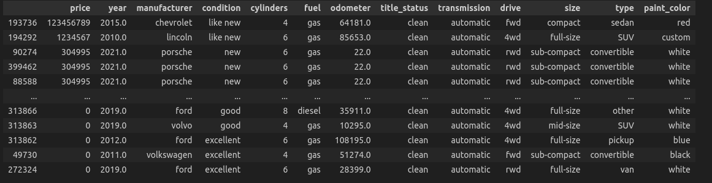
Removed the top two entries from dataset as they are clearly outliers.

Index: 162505 entries, 28 to 426875
Data columns (total 13 columns):
 #   Column        Non-Null Count   Dtype  
---  ------        --------------   -----  
 0   price         162505 non-null  int64  
 1   year          162505 non-null  float64
 2   manufacturer  162505 non-null  object 
 3   condition     162505 non-null  object 
 4   cylinders     162505 non-null  int64  
 5   fuel          162505 non-null  object 
 6   odometer      162505 non-null  float64
 7   title_status  162505 non-null  object 
 8   transmission  162505 non-null  object 
 9   drive         162505 non-null  object 
 10  size          162505 non-null  object 
 11  type          162505 non-null  object 
 12  paint_color   162505 non-null  object 
dtypes: float64(2), int64(2), object(9)
memory usage: 17.4+ MB

#### Transformations:

Analysed the columns we planned to use OrdinalEncoder on: `size`, `condition`, `title_status`
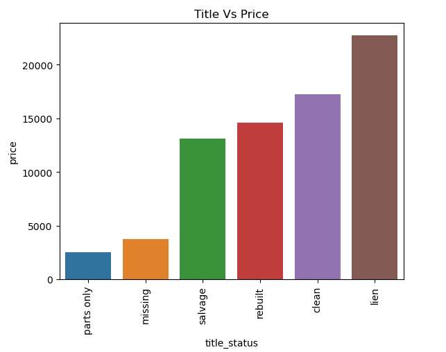
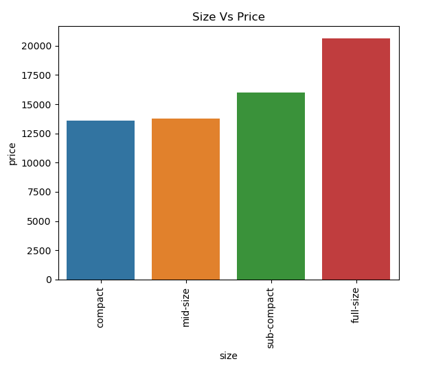
sub-compact seems more expensive than mid-size

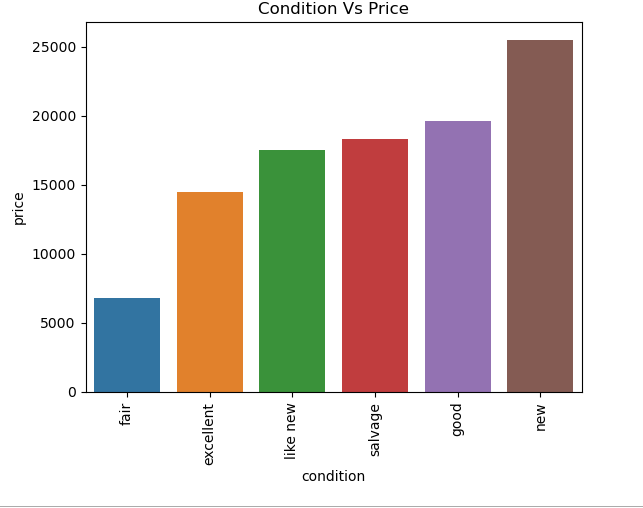
good condition seems more expensive than excellent

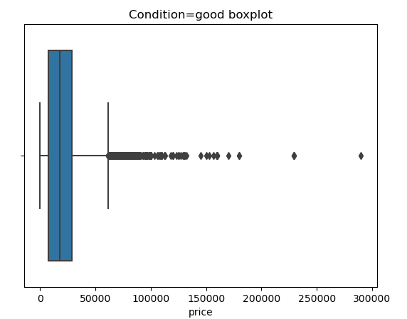
This shows some outliers.

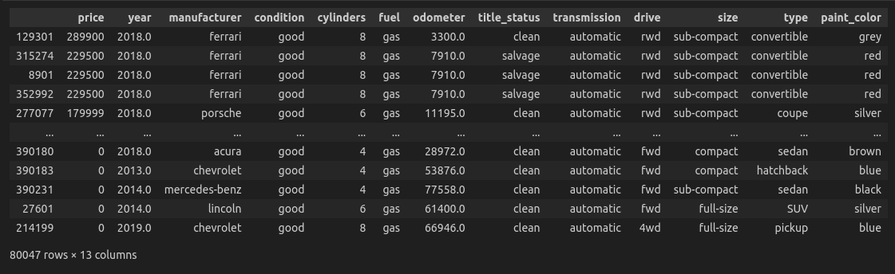
This shows manufacturer can influence price irrespective of condition


Both `size` and `condition` have variations due to car brand, might not be ideal to use OrdinalEncoder for these.

Based on our decisions so far, we will apply the following encoder to the columns:

```
oe_title = OrdinalEncoder(categories = [['parts only', 'missing', 'salvage', 'rebuilt', 'clean', 'lien']])
ohe = OneHotEncoder(drop = 'if_binary', sparse_output=False, handle_unknown="ignore")
ct = ColumnTransformer(transformers=[
    ("oe_title", oe_title, ['title_status']),
    ("ohe", ohe, ['condition','size','drive', 'type', 'fuel', 'transmission', 'manufacturer', 'paint_color'] )],
    remainder='passthrough'
)
```

Final dataset is as follows:
ndex: 162505 entries, 28 to 426875
Data columns (total 92 columns):
 #   Column                             Non-Null Count   Dtype  
---  ------                             --------------   -----  
 0   oe_title__title_status             162505 non-null  float64
 1   ohe__condition_excellent           162505 non-null  float64
 2   ohe__condition_fair                162505 non-null  float64
 3   ohe__condition_good                162505 non-null  float64
 4   ohe__condition_like new            162505 non-null  float64
 5   ohe__condition_new                 162505 non-null  float64
 6   ohe__condition_salvage             162505 non-null  float64
 7   ohe__size_compact                  162505 non-null  float64
 8   ohe__size_full-size                162505 non-null  float64
 9   ohe__size_mid-size                 162505 non-null  float64
 10  ohe__size_sub-compact              162505 non-null  float64
 11  ohe__drive_4wd                     162505 non-null  float64
 12  ohe__drive_fwd                     162505 non-null  float64
 13  ohe__drive_rwd                     162505 non-null  float64
 14  ohe__type_SUV                      162505 non-null  float64
 15  ohe__type_bus                      162505 non-null  float64
 16  ohe__type_convertible              162505 non-null  float64
 17  ohe__type_coupe                    162505 non-null  float64
 18  ohe__type_hatchback                162505 non-null  float64
 19  ohe__type_mini-van                 162505 non-null  float64
 20  ohe__type_offroad                  162505 non-null  float64
 21  ohe__type_other                    162505 non-null  float64
 22  ohe__type_pickup                   162505 non-null  float64
 23  ohe__type_sedan                    162505 non-null  float64
 24  ohe__type_truck                    162505 non-null  float64
 25  ohe__type_van                      162505 non-null  float64
 26  ohe__type_wagon                    162505 non-null  float64
 27  ohe__fuel_diesel                   162505 non-null  float64
 28  ohe__fuel_electric                 162505 non-null  float64
 29  ohe__fuel_gas                      162505 non-null  float64
 30  ohe__fuel_hybrid                   162505 non-null  float64
 31  ohe__fuel_other                    162505 non-null  float64
 32  ohe__transmission_automatic        162505 non-null  float64
 33  ohe__transmission_manual           162505 non-null  float64
 34  ohe__transmission_other            162505 non-null  float64
 35  ohe__manufacturer_acura            162505 non-null  float64
 36  ohe__manufacturer_alfa-romeo       162505 non-null  float64
 37  ohe__manufacturer_aston-martin     162505 non-null  float64
 38  ohe__manufacturer_audi             162505 non-null  float64
 39  ohe__manufacturer_bmw              162505 non-null  float64
 40  ohe__manufacturer_buick            162505 non-null  float64
 41  ohe__manufacturer_cadillac         162505 non-null  float64
 42  ohe__manufacturer_chevrolet        162505 non-null  float64
 43  ohe__manufacturer_chrysler         162505 non-null  float64
 44  ohe__manufacturer_datsun           162505 non-null  float64
 45  ohe__manufacturer_dodge            162505 non-null  float64
 46  ohe__manufacturer_ferrari          162505 non-null  float64
 47  ohe__manufacturer_fiat             162505 non-null  float64
 48  ohe__manufacturer_ford             162505 non-null  float64
 49  ohe__manufacturer_gmc              162505 non-null  float64
 50  ohe__manufacturer_harley-davidson  162505 non-null  float64
 51  ohe__manufacturer_honda            162505 non-null  float64
 52  ohe__manufacturer_hyundai          162505 non-null  float64
 53  ohe__manufacturer_infiniti         162505 non-null  float64
 54  ohe__manufacturer_jaguar           162505 non-null  float64
 55  ohe__manufacturer_jeep             162505 non-null  float64
 56  ohe__manufacturer_kia              162505 non-null  float64
 57  ohe__manufacturer_land rover       162505 non-null  float64
 58  ohe__manufacturer_lexus            162505 non-null  float64
 59  ohe__manufacturer_lincoln          162505 non-null  float64
 60  ohe__manufacturer_mazda            162505 non-null  float64
 61  ohe__manufacturer_mercedes-benz    162505 non-null  float64
 62  ohe__manufacturer_mercury          162505 non-null  float64
 63  ohe__manufacturer_mini             162505 non-null  float64
 64  ohe__manufacturer_mitsubishi       162505 non-null  float64
 65  ohe__manufacturer_nissan           162505 non-null  float64
 66  ohe__manufacturer_pontiac          162505 non-null  float64
 67  ohe__manufacturer_porsche          162505 non-null  float64
 68  ohe__manufacturer_ram              162505 non-null  float64
 69  ohe__manufacturer_rover            162505 non-null  float64
 70  ohe__manufacturer_saturn           162505 non-null  float64
 71  ohe__manufacturer_subaru           162505 non-null  float64
 72  ohe__manufacturer_tesla            162505 non-null  float64
 73  ohe__manufacturer_toyota           162505 non-null  float64
 74  ohe__manufacturer_volkswagen       162505 non-null  float64
 75  ohe__manufacturer_volvo            162505 non-null  float64
 76  ohe__paint_color_black             162505 non-null  float64
 77  ohe__paint_color_blue              162505 non-null  float64
 78  ohe__paint_color_brown             162505 non-null  float64
 79  ohe__paint_color_custom            162505 non-null  float64
 80  ohe__paint_color_green             162505 non-null  float64
 81  ohe__paint_color_grey              162505 non-null  float64
 82  ohe__paint_color_orange            162505 non-null  float64
 83  ohe__paint_color_purple            162505 non-null  float64
 84  ohe__paint_color_red               162505 non-null  float64
 85  ohe__paint_color_silver            162505 non-null  float64
 86  ohe__paint_color_white             162505 non-null  float64
 87  ohe__paint_color_yellow            162505 non-null  float64
 88  remainder__price                   162505 non-null  int64  
 89  remainder__year                    162505 non-null  float64
 90  remainder__cylinders               162505 non-null  int64  
 91  remainder__odometer                162505 non-null  float64
dtypes: float64(90), int64(2)
memory usage: 115.3 MB

#### Correlation check
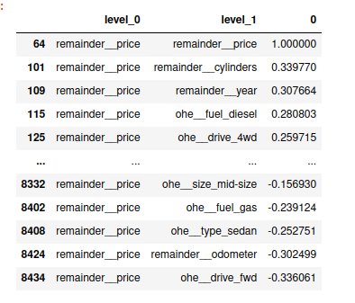

It seems there is no direct strong correlation but `cylinders` , `year`  , `odometer` , `drive_fwd` have weak correlation to `price` when compared to other features
We have 92 columns which is a lot to model due to slow runtime,need to look at reducing dimensionality and pick only the top features to do the modeling.

#### Dataset split up
As part of further preparation we split the data into training, dev and cross validation sets. The split will be 80/20 between (training+dev) and (cross-validation).
Then we further split the (training+dev) into train and test sets again 80/20.
The resulting size of the sets are as follows:
Training : (104003, 92)
Dev      :  (26001, 92)
CV       : (32501, 92)

#### Data Scaling
Then we scale the data using StandardScaler() on all the sets.

#### Dimensionality Reduction

Picking top features:
1. Feature Importance

Using Ridge regression with Feature Importance, the following is the plot of features by importance means:
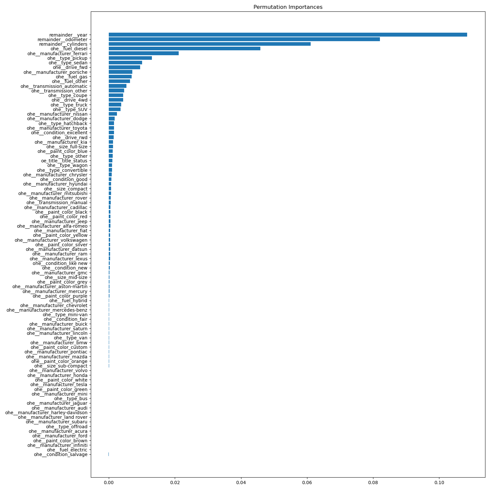

The top features align with what we saw with correlation matrix.

2. Principal Component Analysis:

Performing PCA on the dataset with 80% variance retention, the dimensionality was reduced to (104003, 59) for the training set
The features are:

['remainder__cylinders',
 'ohe__transmission_other',
 'ohe__drive_4wd',
 'ohe__fuel_gas',
 'ohe__condition_good',
 'ohe__size_compact',
 'ohe__size_mid-size',
 'ohe__paint_color_black',
 'ohe__condition_excellent',
 'ohe__type_pickup',
 'ohe__size_sub-compact',
 'ohe__manufacturer_dodge',
 'ohe__fuel_electric',
 'ohe__fuel_electric',
 'ohe__manufacturer_chevrolet',
 'ohe__manufacturer_ford',
 'ohe__manufacturer_toyota',
 'ohe__condition_like new',
 'ohe__paint_color_blue',
 'ohe__paint_color_silver',
 'ohe__manufacturer_mitsubishi',
 'ohe__condition_like new',
 'ohe__paint_color_grey',
 'ohe__manufacturer_nissan',
 'ohe__manufacturer_ram',
 'ohe__manufacturer_buick',
 'ohe__manufacturer_chevrolet',
 'ohe__paint_color_blue',
 'ohe__paint_color_brown',
 'oe_title__title_status',
 'ohe__paint_color_custom',
 'ohe__manufacturer_lexus',
 'ohe__manufacturer_audi',
 'ohe__manufacturer_gmc',
 'ohe__manufacturer_mercedes-benz',
 'ohe__paint_color_green',
 'ohe__manufacturer_rover',
 'ohe__manufacturer_honda',
 'ohe__manufacturer_volvo',
 'ohe__manufacturer_volvo',
 'ohe__manufacturer_infiniti',
 'ohe__manufacturer_lincoln',
 'ohe__manufacturer_rover',
 'ohe__manufacturer_mercury',
 'ohe__manufacturer_saturn',
 'ohe__manufacturer_datsun',
 'ohe__manufacturer_mercury',
 'ohe__manufacturer_harley-davidson',
 'ohe__manufacturer_land rover',
 'ohe__manufacturer_aston-martin',
 'ohe__type_bus',
 'ohe__manufacturer_jaguar',
 'ohe__paint_color_green',
 'ohe__manufacturer_fiat',
 'ohe__type_bus',
 'ohe__paint_color_green',
 'ohe__manufacturer_rover',
 'ohe__manufacturer_buick',
 'oe_title__title_status']

 These don't correspond well to the Feature Importance or the Correlation Matrix

3. Sequential Feature Selection
The top 10 features picked via SFS with Ridge is as follows:

['ohe__condition_excellent',
 'ohe__drive_fwd',
 'ohe__type_pickup',
 'ohe__fuel_diesel',
 'ohe__transmission_automatic',
 'ohe__manufacturer_ferrari',
 'ohe__manufacturer_porsche',
 'remainder__year',
 'remainder__cylinders',
 'remainder__odometer']

 This corresponds well to both the correlation matrix and the feature importance.

 Choosing the right dimensionality reduction method:
 
 Since Feature importance, correlation matrix and SFS give similar top features, it makes sense to use one of them for dimensionality reduction.
 SFS has the disadvantage of slow computation when picking higher number of features. Hence Feature Importance is the preferable choice. Will explore the performance of these methods in the modeling section below.

## 4.0 Modeling
The approach we will take to finding a good model is as follows:

1. Find the right set of hyperparameters using top 10 features with GridSearchCV, Ridge and PolynomialFeatures(as this is computationally reasonable)
2. Find the right number of features to include for good performance
3. Verify with cross validation

#### Performance metrics
Metrics used are Mean Squared Error and R2 Score. MSE is mainly used to find the right number of features by analyzing the trend of test set MSE.
R2 Score is used to gauge how well our model fits the dataset.

#### Feature Importance:
Top 10 features hyperparameters: polynomial degree:2 and Ridge alpha:10

Running with 5 to 45 features:


Will pick 40 features as it gives better R2 score:

Num features 10:
Train R2 : 0.458
Test R2: 0.424

Num features 30:
Train R2: 0.510
Test R2: 0.499

Num features 35:
Train R2: 0.517
Test R2: 0.504

Num features 40:
Train R2: 0.522
Test R2: 0.507

Num features 45:
Train R2: 0.525
Test R2: 0.502

Top 10 features were fitted with Linear Regression and Lasso as well to find hyperparameters.
Linear Regression resulted in lower R2 score. Lasso performed as well as the Ridge regression.

Linear Regression with 11 features:(highest R2)
Train R2: 0.458
Test R2: 0.422

Lasso Regression with 40 features:
Train R2: 0.520
Test R2: 0.507

#### SFS and PCA:

With SFS, the train and test R2 for 10 features are:
Train R2 Score : 0.390
Test R2 Score : 0.370

This score is in the same ballpark as with Feature Importance but it will result in slow computation to go with higher number of features.

With PCA, the performance is much poorer with top 10 features:
Train R2 Score : 0.278
Test R2 Score : 0.283

#### Cross Validation
Doing cross validation using the top 40 features on the CV set:
R2 Score : 0.474

This is a little lower than the dev/test set but same when rounded to 1 digit.


## 5.0 Evaluation
To further evaluate the number of features we need to pick, performed cross validation test with different number of features.
R2 with 10 features : 0.438
R2 with 35 features : 0.477
R2 with 20 features : 0.450

The cross validation set R2 follows the dev/test set R2 closely in all cases. So, still 40 features is the best so far.
Overall the model fits the dataset 50%. This is the best we can obtain with the current cleaning,prep and modeling methods. There are other ways to further improve the model by analysing dataset statewise,regionwise or even manufacturerwise 

## 6.0 Deployment
After analysing the used car dataset with supervised machine learning techniques, the below are the top three features that drive the price.

Year:
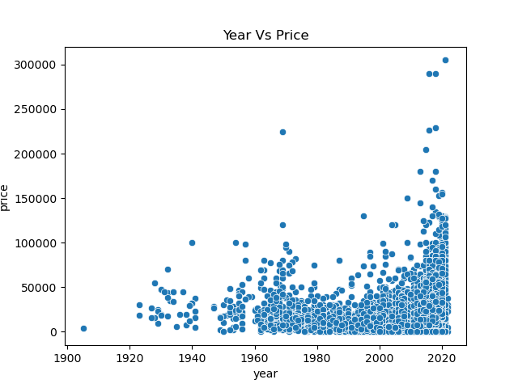

Odometer:
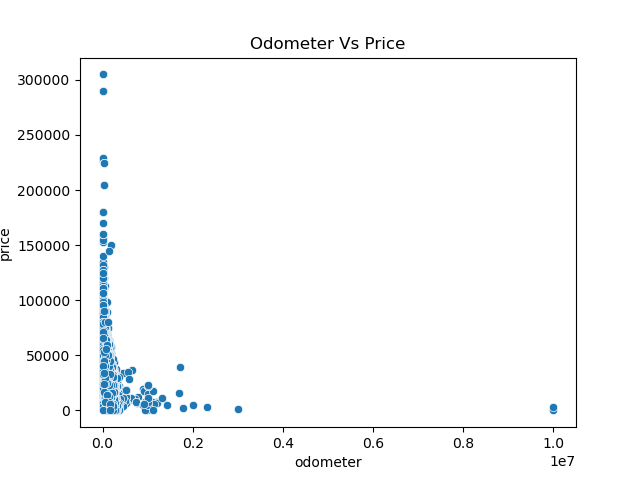

Cylinders:
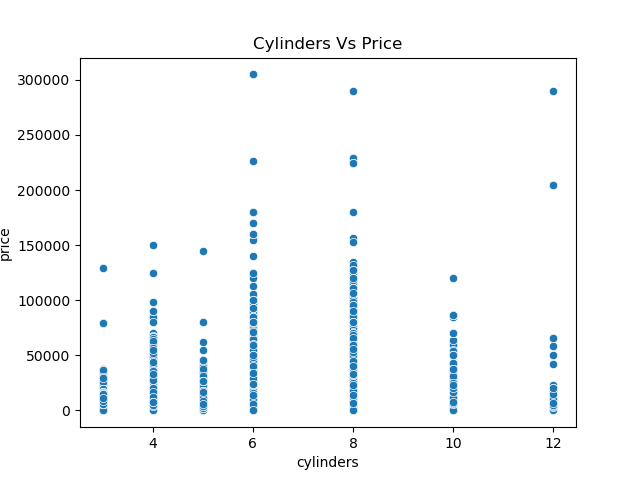

Other findings from the analysis are:
1. Apart from the top three listed above, `Fuel`, `Manufacturer`, `Type`, `Transmission`, `Condition` influence the price
2. Manufacturer can sometimes break trends and drive price for example 'Ferrari'
3. Title Status has lesser influence on price as long as the condition is good or better

Overall fit of the model to dataset is 50% which can be further improved by cleaner data and better and more complex algorithms.


 


