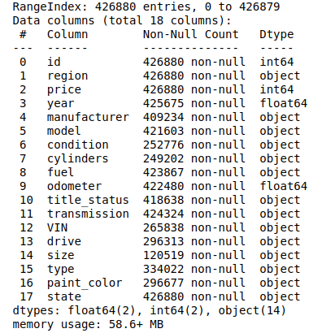
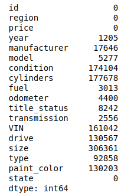
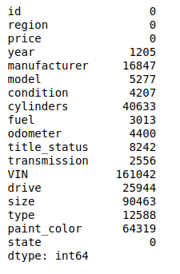
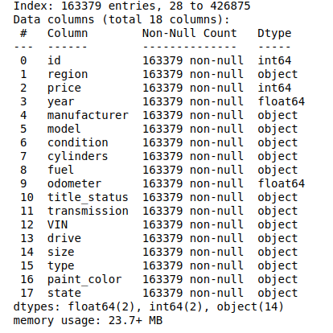
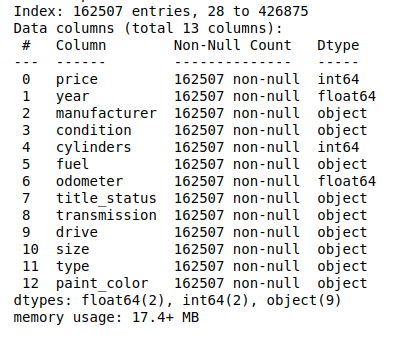
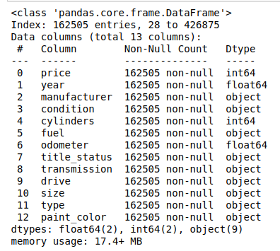
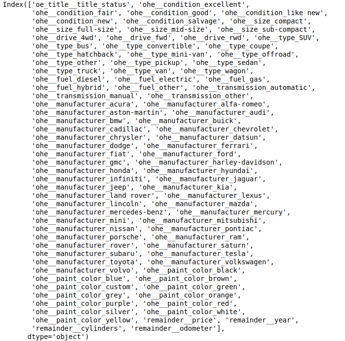
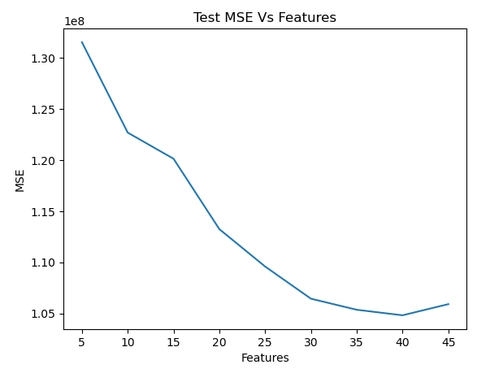

# Study of factors that drive price of used cars
The dataset under study contains information on used cars and their sale price. The goal of this case study is to come up with what features drive the sale price of a used car.

## 1. Business Understanding
In earlier days, when all cars were gas or diesel driven, there was enough experience among the staff to determine what cars would sell at a high price. With the introduction of hybrid and electric vehicles and autonomous features, there are different factors that influence the used car sale. Data science can see hidden patterns and provide a better way to determine the factors that drive sale price and help the business make more profits.


### 1.1 Business Goals
1. Predict sale price of used car that is yet to be procured by the business
2. Educate on what factors drive the sale price for different category of vehicles.
3. Report any limitations of findings

## 2. Data Understanding
Here we take an initial look at the given data and explore the quality of it.

### 2.1 Gather Data And Describe
The original dataset is from Kaggle and it contained information on 3 million used cars. The dataset used is pruned and contains information on 426K cars to ensure speed of processing. 

Here is a sample of the data:


More info on the type of data:



Initial observations:
1. We have 426880 entries and 18 columns
2. There are quite a lot of 'NaN' values in the dataset across columns
3. Most of the features are categorical

### 2.2 Early Data Exploration and Quality Check
In this section, we determine the following:
1. Are there duplicates in the data?
2. What columns have NaN values and how many?
3. Are there any structural issues with the data including typos and dtype?

#### Duplicates:
Check for duplicates returned the following:

Number of duplicates: 0

#### Null Values:

Null value check returned the following:



General guideline for filling columns based on domain:
1. Only columns that have 10000 or more NaN are considered
2. 'Manufacturer' can be filled from 'Model'
3. 'Cylinders' can be filled from 'Model'
4. 'Condition' can be filled from 'odometer' and 'year'
5. 'Type', 'Size', 'Drive' all can be filled from 'model'
6. 'paint_color' can be filled from 'model' and 'price'

#### Structural Issues

The major structural issue is that columns which say type as 'object' are not string and need to be converted to string

#### General Observations


Existing numerical columns have skewed distribution, they need to be normalized


Ferrari has a very high price point compared to others which is accurate


We seem to have a lot of outliers in 'price', have to handle this after we fill/remove NaN

Based on analysing the above, the following decisions are taken:

Most of the columns are categorical, so should use OneHot or Ordinal Encoders and some columns can be removed
1. 'id', 'VIN' can be dropped as they don't affect the 'price'
2. 'region', 'state', 'model' have too many unique values and OneHotEncoding these will add noise to data. These can be removed before modeling
3. OrdinalEncoder can be used for 'condition' and 'title_status' and 'size'
4. OneHotEncoder can be used for 'type', 'drive' , 'paint_color', 'manufacturer', 'fuel','transmission'
5. Use StandardScaler to normalize data before modeling

## 3. Data Preparation
In this section, we will act on the observation and decisions taken above.

1. Fill NaN
2. Remove unnecessary columns
3. Fix all structural issues and remove outliers
4. Apply transformations for categorical columns
5. Split the data into train,dev,cross validation sets
5. Perform data scaling
6. Perform dimensionality reduction


#### Fill null values or remove
General guidelines listed in the `Data Understanding` section is followed to fill the following values:
1. manufacturer
2. paint_color
3. type
4. size
5. condition
6. drive
7. cylinders

Dataset after fill:



The we drop all remaining NaN:



#### Structural Issues:

All object types which were of type 'float' were converted to string.
Columns `VIN`, `id`, `region`, `state`, `model` are removed.
Converted `cylinders` column values to numeric.



#### Outliers removal

The dataset when sorted by `price` is as follows:

Removed the top two entries from dataset as they are clearly outliers.



#### Transformations:

Analysed the columns we planned to use OrdinalEncoder on: `size`, `condition`, `title_status`


Sub-compact seems more expensive than mid-size


Good condition seems more expensive than excellent


This shows some outliers.


This shows manufacturer can influence price irrespective of condition


Both `size` and `condition` have variations due to car brand, might not be ideal to use OrdinalEncoder for these.

Based on our decisions so far, we will apply the following encoder to the columns:

```
oe_title = OrdinalEncoder(categories = [['parts only', 'missing', 'salvage', 'rebuilt', 'clean', 'lien']])
ohe = OneHotEncoder(drop = 'if_binary', sparse_output=False, handle_unknown="ignore")
ct = ColumnTransformer(transformers=[
    ("oe_title", oe_title, ['title_status']),
    ("ohe", ohe, ['condition','size','drive', 'type', 'fuel', 'transmission', 'manufacturer', 'paint_color'] )],
    remainder='passthrough'
)
```

Final dataset is as follows:
```
Index: 162505 entries, 28 to 426875
Data columns (total 92 columns):
dtypes: float64(90), int64(2)
```



#### Correlation check


It seems there is no direct strong correlation but `cylinders` , `year`  , `odometer` , `drive_fwd` have weak correlation to `price` when compared to other features
We have 92 columns which is a lot to model due to slow runtime,need to look at reducing dimensionality and pick only the top features to do the modeling.

#### Dataset split up
As part of further preparation we split the data into training, dev and cross validation sets. The split will be 80/20 between (training+dev) and (cross-validation).
Then we further split the (training+dev) into train and test sets again 80/20.
The resulting size of the sets are as follows:
Training : (104003, 92)
Dev      :  (26001, 92)
CV       : (32501, 92)

#### Data Scaling
Then we scale the data using StandardScaler() on all the sets.

#### Dimensionality Reduction

Picking top features:
1. Feature Importance

Using Ridge regression with Feature Importance, the following is the plot of features by importance means:


The top features align with what we saw with correlation matrix.

2. Principal Component Analysis:

Performing PCA on the dataset with 80% variance retention, the dimensionality was reduced to (104003, 59) for the training set.

The features are:

```
['remainder__cylinders',
 'ohe__transmission_other',
 'ohe__drive_4wd',
 'ohe__fuel_gas',
 'ohe__condition_good',
 'ohe__size_compact',
 'ohe__size_mid-size',
 'ohe__paint_color_black',
 'ohe__condition_excellent',
 'ohe__type_pickup',
 'ohe__size_sub-compact',
 'ohe__manufacturer_dodge',
 'ohe__fuel_electric',
 'ohe__fuel_electric',
 'ohe__manufacturer_chevrolet',
 'ohe__manufacturer_ford',
 'ohe__manufacturer_toyota',
 'ohe__condition_like new',
 'ohe__paint_color_blue',
 'ohe__paint_color_silver',
 'ohe__manufacturer_mitsubishi',
 'ohe__condition_like new',
 'ohe__paint_color_grey',
 'ohe__manufacturer_nissan',
 'ohe__manufacturer_ram',
 'ohe__manufacturer_buick',
 'ohe__manufacturer_chevrolet',
 'ohe__paint_color_blue',
 'ohe__paint_color_brown',
 'oe_title__title_status',
 'ohe__paint_color_custom',
 'ohe__manufacturer_lexus',
 'ohe__manufacturer_audi',
 'ohe__manufacturer_gmc',
 'ohe__manufacturer_mercedes-benz',
 'ohe__paint_color_green',
 'ohe__manufacturer_rover',
 'ohe__manufacturer_honda',
 'ohe__manufacturer_volvo',
 'ohe__manufacturer_volvo',
 'ohe__manufacturer_infiniti',
 'ohe__manufacturer_lincoln',
 'ohe__manufacturer_rover',
 'ohe__manufacturer_mercury',
 'ohe__manufacturer_saturn',
 'ohe__manufacturer_datsun',
 'ohe__manufacturer_mercury',
 'ohe__manufacturer_harley-davidson',
 'ohe__manufacturer_land rover',
 'ohe__manufacturer_aston-martin',
 'ohe__type_bus',
 'ohe__manufacturer_jaguar',
 'ohe__paint_color_green',
 'ohe__manufacturer_fiat',
 'ohe__type_bus',
 'ohe__paint_color_green',
 'ohe__manufacturer_rover',
 'ohe__manufacturer_buick',
 'oe_title__title_status']
```

 These don't correspond well to the Feature Importance or the Correlation Matrix

3. Sequential Feature Selection

The top 10 features picked via SFS with Ridge is as follows:

```
['ohe__condition_excellent',
 'ohe__drive_fwd',
 'ohe__type_pickup',
 'ohe__fuel_diesel',
 'ohe__transmission_automatic',
 'ohe__manufacturer_ferrari',
 'ohe__manufacturer_porsche',
 'remainder__year',
 'remainder__cylinders',
 'remainder__odometer']
```

 This corresponds well to both the correlation matrix and the feature importance.

 Choosing the right dimensionality reduction method:
 
 Since Feature importance, correlation matrix and SFS give similar top features, it makes sense to use one of them for dimensionality reduction.
 SFS has the disadvantage of slow computation when picking higher number of features. Hence Feature Importance is the preferable choice. Will explore the performance of these methods in the modeling section below.

## 4.0 Modeling
The approach we will take to finding a good model is as follows:

1. Find the right set of hyperparameters using top 10 features with GridSearchCV, Ridge and PolynomialFeatures(as this is computationally reasonable)
2. Find the right number of features to include for good performance
3. Verify with cross validation

#### Performance metrics
Metrics used are Mean Squared Error and R2 Score. MSE is mainly used to find the right number of features by analyzing the trend of test set MSE.
R2 Score is used to gauge how well our model fits the dataset.

#### Feature Importance:
Top 10 features hyperparameters: polynomial degree:2 and Ridge alpha:10

Running with 5 to 45 features:



Will pick 40 features as it gives better R2 score:
```
Num features 10:
Train R2 : 0.458
Test R2: 0.424

Num features 30:
Train R2: 0.510
Test R2: 0.499

Num features 35:
Train R2: 0.517
Test R2: 0.504

Num features 40:
Train R2: 0.522
Test R2: 0.507

Num features 45:
Train R2: 0.525
Test R2: 0.502
```
Top 10 features were fitted with Linear Regression and Lasso as well to find hyperparameters.
Linear Regression resulted in lower R2 score. Lasso performed as well as the Ridge regression.

Linear Regression with 11 features:(highest R2)
```
Train R2: 0.458
Test R2: 0.422
```

Lasso Regression with 40 features:
```
Train R2: 0.520
Test R2: 0.507
```

#### SFS and PCA:

With SFS, the train and test R2 for 10 features are:
```
Train R2 Score : 0.390
Test R2 Score : 0.370
```

This score is in the same ballpark as with Feature Importance but it will result in slow computation if we go with higher number of features.

With PCA, the performance is much poorer with top 10 features:
```
Train R2 Score : 0.278
Test R2 Score : 0.283
```

#### Cross Validation
Doing cross validation using the top 40 features on the CV set:
```
R2 Score : 0.474
```

This is a little lower than the dev/test set but same when rounded to 1 digit.


## 5.0 Evaluation
To further evaluate the number of features we need to pick, performed cross validation test with different number of features.
```
R2 with 10 features : 0.438
R2 with 35 features : 0.477
R2 with 20 features : 0.450
```

The cross validation set R2 follows the dev/test set R2 closely in all cases. So, still 40 features is the best so far.
Overall the model fits the dataset 50%. This is the best we can obtain with the current cleaning,prep and modeling methods. There are other ways to further improve the model by analysing dataset statewise,regionwise or even manufacturerwise 

## 6.0 Deployment
After analysing the used car dataset with supervised machine learning techniques, the below are the top three features that drive the price.

Year:


Odometer:


Cylinders:


Other findings from the analysis are:
1. Apart from the top three listed above, `Fuel`, `Manufacturer`, `Type`, `Transmission`, `Condition` influence the price
2. Manufacturer can sometimes break trends and drive price for example 'Ferrari'
3. Title Status has lesser influence on price as long as the condition is good or better

Overall fit of the model to dataset is 50% which can be further improved by cleaner data and better and more complex algorithms.


 


